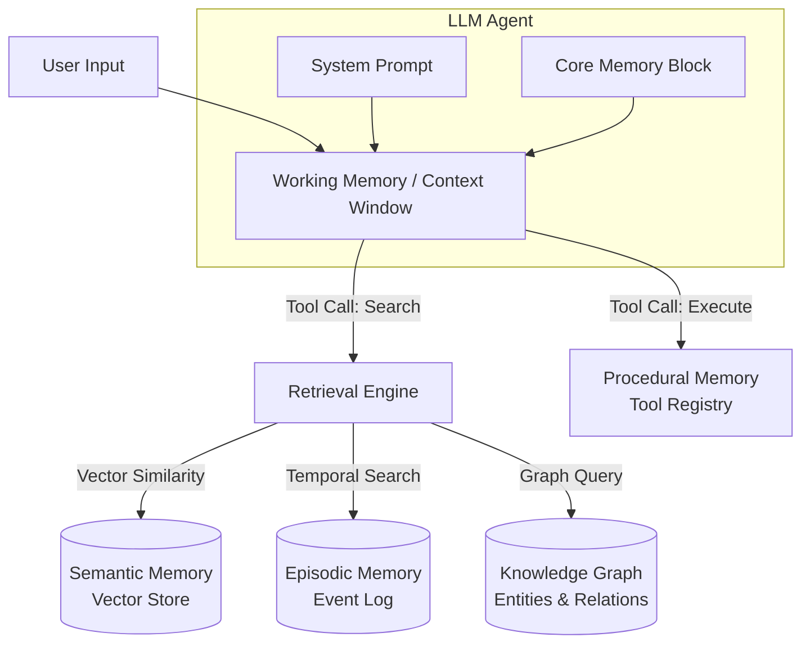

# Module 3: Agentic AI Memory Systems

Welcome to Module 3 of the Agentic AI curriculum. In this module, we will explore the critical role of memory in autonomous systems. Unlike simple chatbots that treat each interaction as an isolated event, agentic systems require robust memory architectures to maintain context, learn over time, and execute complex, multi-step plans.

This module provides a deep technical dive into building and managing memory for LLM-based agents, moving from simple context window management to complex, multi-tiered architectures inspired by operating systems and cognitive science.

---

## 1. Taxonomy of Agent Memory

To build effective agents, we must first categorize the types of memory they require. We draw heavily from human cognitive science to structure AI memory systems.

### Working Memory (Short-term)
Working memory is the agent's immediate awareness. Technically, this is the context window of the Large Language Model.
*   **Characteristics:** Extremely fast, limited capacity, volatile.
*   **Contents:** The system prompt, the current task instructions, recent conversation history, and temporary scratchpad space.
*   **Constraint:** Bounded by token limits (e.g., 8k, 32k, 128k tokens) and context degradation (models lose precision when retrieving facts from the middle of long contexts).

### Long-Term Memory
Long-term memory provides persistent storage beyond the context window. It is generally divided into three sub-types:

#### Episodic Memory
*   **Definition:** Memory of specific events, experiences, and conversational turns, organized chronologically.
*   **Use Case:** Allowing the agent to remember what it did yesterday or the exact phrasing a user used in a past interaction.
*   **Implementation:** Append-only logs, often indexed in a vector database combined with temporal metadata.

#### Semantic Memory
*   **Definition:** General world knowledge, facts, and concepts decoupled from specific events.
*   **Use Case:** Knowing that Paris is the capital of France, or understanding the specifications of an internal API.
*   **Implementation:** Vector databases (RAG), Document stores, and Knowledge Graphs.

#### Procedural Memory
*   **Definition:** Memory of how to perform tasks and execute skills.
*   **Use Case:** Using tools, calling APIs, or writing specific code patterns.
*   **Implementation:** Code repositories, prompt templates, tool registries, and fine-tuned model weights.

### Memory Architecture Diagram



---

## 2. Short-Term Context Management

The most fundamental memory challenge is managing the limited working memory (context window). As a conversation progresses, it will eventually exceed the token limit.

### Fixed vs. Token-Budget Windows
A naive approach uses a fixed number of messages (e.g., "keep the last 10 messages"). This is dangerous because 10 very long messages might still exceed the token limit, causing API errors. Professional systems use a token-budget approach, calculating exact token counts before appending to the context.

### Context Management Strategies

#### Message Pruning (FIFO)
The simplest strategy. When the token limit is approached, the oldest messages are dropped.
*   **Pros:** Cheap, easy to implement.
*   **Cons:** Complete loss of early context.

#### Rolling Summarization
Instead of dropping messages, older messages are passed to the LLM to be summarized into a compact representation, which replaces the raw messages in the context.

#### Structured Scratchpad
Agents often generate intermediate thoughts (Chain of Thought). To prevent these from flooding the context, the system can parse the output, execute the thought, and then purge the verbose thinking process from the permanent context window, keeping only the final result.

### Python ContextManager Implementation

Using `tiktoken` to strictly manage context size.

```python
import tiktoken
from typing import List, Dict

class ContextManager:
    def __init__(self, model: str = "gpt-4", max_tokens: int = 8000, system_prompt: str = ""):
        self.encoder = tiktoken.encoding_for_model(model)
        self.max_tokens = max_tokens
        self.system_prompt = {"role": "system", "content": system_prompt}
        self.messages = []
        
    def _count_tokens(self, text: str) -> int:
        return len(self.encoder.encode(text))
        
    def add_message(self, role: str, content: str):
        self.messages.append({"role": role, "content": content})
        self.enforce_budget()
        
    def enforce_budget(self):
        # Calculate overhead and system prompt tokens
        current_tokens = self._count_tokens(self.system_prompt["content"]) + 10 
        
        retained = []
        # Traverse backwards, keeping newest messages first
        for msg in reversed(self.messages):
            msg_tokens = self._count_tokens(msg["content"]) + 5
            if current_tokens + msg_tokens <= self.max_tokens:
                retained.insert(0, msg)
                current_tokens += msg_tokens
            else:
                break
                
        self.messages = retained
        
    def get_context(self) -> List[Dict[str, str]]:
        return [self.system_prompt] + self.messages
```

---

## 3. Long-Term Memory with Vector Stores

When information exceeds the working memory, it must be stored externally. Vector stores are the standard for semantic and episodic memory.

### The Vector Memory Pipeline
1.  **Chunking:** Splitting large texts into smaller, semantically meaningful pieces.
2.  **Embedding:** Converting text chunks into high-dimensional numerical vectors using models like `text-embedding-3-small`.
3.  **Indexing:** Storing the vectors in a database (e.g., Pinecone, Chroma) optimized for similarity search.
4.  **Retrieval (Hybrid Search):** Combining vector similarity (cosine distance) with traditional keyword search (BM25) to ensure precise recall, especially for proper nouns and unique identifiers.

### Memory Scoring Formula (Generative Agents)
Not all memories are equally relevant. The Generative Agents architecture ranks memories based on a composite score:

`Score = (α * Recency) + (β * Importance) + (γ * Relevance)`

*   **Recency:** Exponential decay based on time.
*   **Importance:** An integer (1-10) assigned by the LLM indicating how critical the memory is.
*   **Relevance:** Cosine similarity between the query embedding and memory embedding.

### Python Vector Memory Store Example

```python
import numpy as np
from datetime import datetime, timedelta
import math

class MemoryItem:
    def __init__(self, content: str, embedding: List[float], importance: int):
        self.content = content
        self.embedding = np.array(embedding)
        self.importance = importance
        self.last_access = datetime.now()

class VectorMemory:
    def __init__(self, decay_rate: float = 0.99):
        self.memories: List[MemoryItem] = []
        self.decay_rate = decay_rate
        
    def add_memory(self, content: str, embedding: List[float], importance: int):
        self.memories.append(MemoryItem(content, embedding, importance))
        
    def cosine_similarity(self, vec1: np.ndarray, vec2: np.ndarray) -> float:
        dot = np.dot(vec1, vec2)
        norm = np.linalg.norm(vec1) * np.linalg.norm(vec2)
        return dot / norm if norm > 0 else 0
        
    def retrieve(self, query_embedding: List[float], top_k: int = 5) -> List[str]:
        q_vec = np.array(query_embedding)
        scores = []
        now = datetime.now()
        
        for mem in self.memories:
            # Relevance
            relevance = self.cosine_similarity(q_vec, mem.embedding)
            
            # Recency (Exponential Decay)
            hours_passed = (now - mem.last_access).total_seconds() / 3600
            recency = math.pow(self.decay_rate, hours_passed)
            
            # Composite Score (Alpha=1, Beta=1, Gamma=1)
            score = recency + (mem.importance * 0.1) + relevance
            scores.append((score, mem))
            
        # Sort by highest score
        scores.sort(key=lambda x: x[0], reverse=True)
        
        # Update access time for retrieved items
        results = []
        for _, mem in scores[:top_k]:
            mem.last_access = now
            results.append(mem.content)
            
        return results
```

---

## 4. MemGPT & Tiered Memory Architecture

MemGPT revolutionizes agent memory by treating the LLM context window as RAM and vector databases as disk storage, providing the agent with explicit OS-like system calls to manage its own memory.

### The Tiers
1.  **Core Memory (RAM):** Always included in the system prompt. Contains crucial information like the agent's persona and core facts about the user.
2.  **Archival Memory (Disk):** Unbounded storage for semantic facts.
3.  **Recall Memory (Disk):** Unbounded storage for chronological conversation history.

### Memory Management Functions
The agent is provided with tools to page information in and out:
*   `core_memory_append(section, text)`
*   `core_memory_replace(section, old_text, new_text)`
*   `archival_memory_search(query)`
*   `archival_memory_insert(text)`

### Python MemGPT-Style Architecture

```python
import json

class MemGPTAgent:
    def __init__(self):
        self.core_memory = {
            "persona": "I am a helpful assistant.",
            "human": "The user is anonymous."
        }
        
    def build_system_prompt(self) -> str:
        prompt = "You are a MemGPT agent. Your current Core Memory is:\n"
        prompt += f"<persona>\n{self.core_memory['persona']}\n</persona>\n"
        prompt += f"<human>\n{self.core_memory['human']}\n</human>\n"
        prompt += "You have tools to edit your Core Memory if facts change."
        return prompt
        
    def execute_tool(self, tool_name: str, arguments: dict):
        if tool_name == "core_memory_replace":
            section = arguments["section"]
            old = arguments["old_text"]
            new = arguments["new_text"]
            if section in self.core_memory and old in self.core_memory[section]:
                self.core_memory[section] = self.core_memory[section].replace(old, new)
                return "Memory updated successfully."
            return "Failed: Text not found in section."
        return "Unknown tool."

# Simulation
agent = MemGPTAgent()
print("Initial Prompt:\n", agent.build_system_prompt())

# Agent decides to update memory based on user input
agent.execute_tool("core_memory_replace", {
    "section": "human",
    "old_text": "The user is anonymous.",
    "new_text": "The user is Alice, a software engineer."
})

print("\nUpdated Prompt:\n", agent.build_system_prompt())
```

---

## 5. Entity & Knowledge Graph Memory

While vector stores are great for fuzzy semantic search, they struggle with complex relationships and multi-hop reasoning. Knowledge Graphs solve this by structuring memory as entities (nodes) and relationships (edges).

### Graph vs. Vector Retrieval
If a user asks, "Who is the CEO of the company that acquired my startup?", a vector search might fail to link the multiple entities. A knowledge graph can traverse the edges: `(User) -> [Founded] -> (Startup) -> [AcquiredBy] -> (Company) -> [HasCEO] -> (CEO)`.

### Python Implementation using NetworkX

```python
import networkx as nx

class GraphMemory:
    def __init__(self):
        self.graph = nx.DiGraph()
        
    def add_fact(self, subject: str, relation: str, object_: str):
        self.graph.add_node(subject)
        self.graph.add_node(object_)
        self.graph.add_edge(subject, object_, relation=relation)
        
    def query_relation(self, subject: str, relation: str) -> List[str]:
        results = []
        if subject in self.graph:
            for neighbor in self.graph.successors(subject):
                edge_data = self.graph.get_edge_data(subject, neighbor)
                if edge_data['relation'] == relation:
                    results.append(neighbor)
        return results

# Usage
kg = GraphMemory()
kg.add_fact("Alice", "works_at", "TechCorp")
kg.add_fact("TechCorp", "located_in", "San Francisco")

print("Alice works at:", kg.query_relation("Alice", "works_at"))
```

---

## 6. Memory Poisoning, Conflict Resolution, and Forgetting

As agents live longer, maintaining the integrity of their memory becomes challenging.

### Memory Poisoning
Adversaries can inject false or malicious information into an agent's memory store. If an agent automatically learns from the web, an attacker can place a prompt injection payload on a website. When retrieved, it executes against the agent. Defense requires rigorous input validation and source provenance tracking.

### Conflict Resolution
When new information contradicts old information (e.g., user moves to a new city), simple retrieval surfaces both facts. Solutions include:
1.  **Recency Bias:** Using the decay formula so newer facts score higher.
2.  **Active Reconciliation:** Having a background LLM process review the vector store periodically to identify and merge contradictions.
3.  **Explicit Core Memory (MemGPT):** Forcing the agent to explicitly delete old facts when writing new ones.

### The Forgetting Curve
Infinite memory is a liability. It increases retrieval latency, costs, and hallucination risks. Implementing an Ebbinghaus-style forgetting curve ensures that mundane, unaccessed memories are eventually archived or permanently deleted, keeping the agent's memory focused and performant.

---
### Section: Hybrid Search & Scoring Mathematics
```python
import numpy as np

def rrf_score(dense_rank: int, sparse_rank: int, k: int = 60) -> float:
    """Reciprocal Rank Fusion (RRF) for combining vector and keyword memory ranks."""
    return (1.0 / (k + dense_rank)) + (1.0 / (k + sparse_rank))

def generative_agent_memory_score(
    relevance_sim: float,
    hours_since_access: float,
    importance_rating: float,
    alpha_recency: float = 0.995,
    w_recency: float = 1.0,
    w_relevance: float = 1.0,
    w_importance: float = 1.0
) -> float:
    """
    Stanford Generative Agents (Park et al.) memory retrieval score:
    Score = w_recency * (alpha ^ hours) + w_relevance * sim + w_importance * (importance / 10)
    """
    recency_score = alpha_recency ** hours_since_access
    normalized_importance = importance_rating / 10.0
    return (w_recency * recency_score) + (w_relevance * relevance_sim) + (w_importance * normalized_importance)
```

### Section: GraphRAG & Entity Memory Extraction
```python
from pydantic import BaseModel, Field
from typing import List

class EntityTriple(BaseModel):
    subject: str = Field(description="Subject entity")
    predicate: str = Field(description="Relationship or action")
    object: str = Field(description="Object entity or property value")
    confidence: float = Field(ge=0.0, le=1.0)
    temporal_validity: str = Field(description="ISO timestamp or 'perpetual'")

class EntityGraphMemory:
    """Extracts and queries knowledge graph triples for multi-hop agent reasoning."""
    def __init__(self):
        self.triples: List[EntityTriple] = []

    def add_triple(self, triple: EntityTriple):
        # Deduplicate and update
        self.triples = [t for t in self.triples if not (t.subject == triple.subject and t.predicate == triple.predicate)]
        self.triples.append(triple)

    def query_subgraph(self, entity: str) -> List[EntityTriple]:
        return [t for t in self.triples if t.subject.lower() == entity.lower() or t.object.lower() == entity.lower()]
```

### Section: Memory Compaction & Context Pruning Algorithms
- Token-aware LRU cache for in-context messages.
- Lossless vs Lossy summarization pipelines.
- Pruning intermediate tool observation blobs while keeping final assistant reasoning.

---
End of Module 3. Ensure you complete the practical exercises building a MemGPT clone in LangGraph before proceeding.


