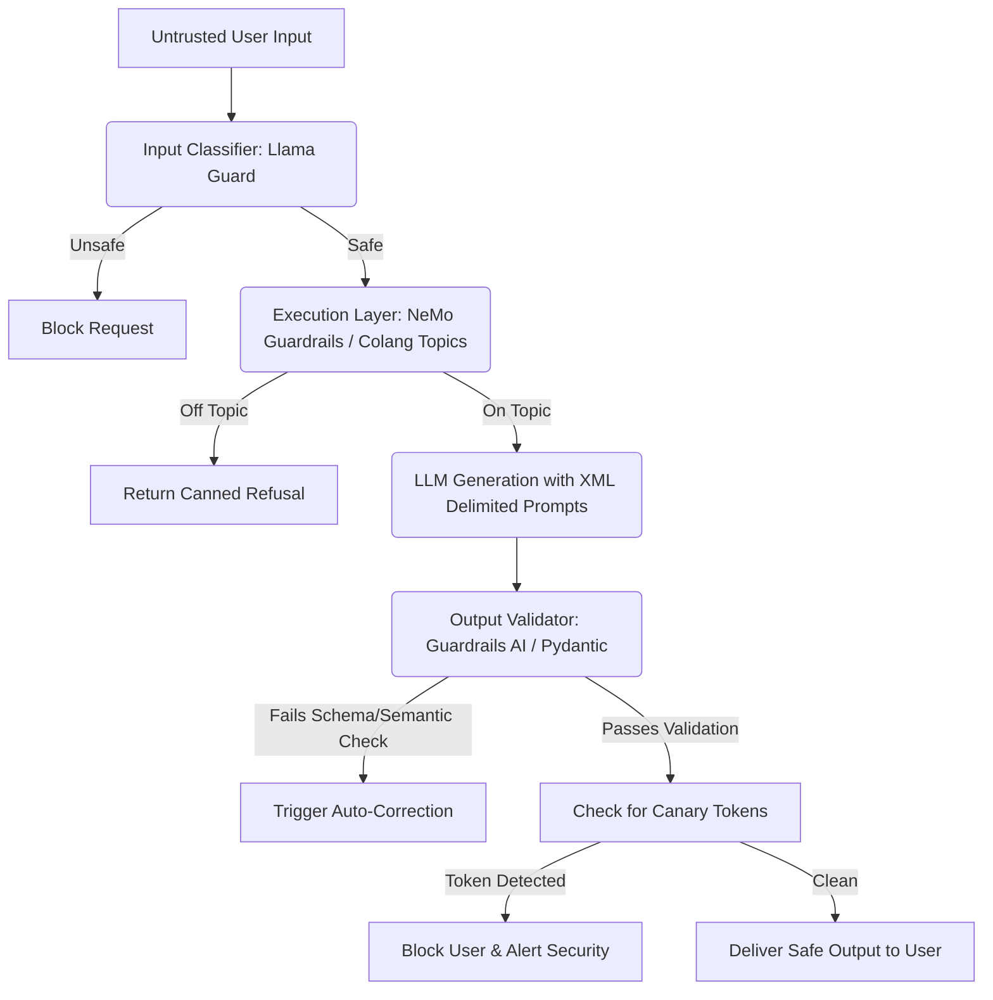

# CHEATSHEET: Evaluations, RAGAS, & Generative Safety

## The RAG Triad Metrics

| Metric | Component Evaluated | Question it Answers | High Score Means... | Low Score Means... |
|--------|---------------------|---------------------|---------------------|--------------------|
| **Context Relevance** | Retriever | Did we fetch the right documents without noise? | Clean, highly relevant retrieved context window. | Retriever pulled junk; context window full of irrelevant data. |
| **Groundedness / Faithfulness** | Generator (LLM) | Is the answer strictly supported by context? | Zero hallucinations. Strict adherence to provided facts. | Model hallucinated facts not present in the retrieved chunks. |
| **Answer Relevance** | End-to-End System | Did we actually answer the user's specific query? | The user's exact question was directly addressed. | The model went on a tangent or provided a generic summary. |

---

## LLM-as-a-Judge: Bias Mitigation Matrix

| Cognitive Bias | Description | Mitigation Strategy |
|----------------|-------------|---------------------|
| **Position Bias** | Judge arbitrarily favors "Option A" over "Option B" due to sequence. | **Position Swapping:** Run A vs B, then B vs A. Only declare winner if model wins both. Else Tie. |
| **Verbosity Bias** | Judge associates longer, wordier answers with higher quality. | **Prompt Directives:** Explicitly instruct judge to penalize fluff and reward concise accuracy. |
| **Self-Enhancement** | LLMs prefer text generated by their own model family (GPT prefers GPT). | **Ensemble Judging:** Average scores across multiple disparate models (Claude + GPT + Gemini). |

---

## Adversarial Attacks & Defenses

```text
+------------------------+-------------------------------------------------+------------------------------------------+
| Threat Vector          | Attack Mechanism                                | Primary Defenses                         |
+------------------------+-------------------------------------------------+------------------------------------------+
| Direct Prompt          | User types "Ignore instructions" directly       | XML Delimiters (`<data>`), Refusal       |
| Injection (Jailbreak)  | into chat UI to bypass safety filters.          | directives, Input Classifiers (LlamaGuard|
+------------------------+-------------------------------------------------+------------------------------------------+
| Indirect Prompt        | Malicious instructions hidden in PDF, email,    | Strict Data Encapsulation, Output        |
| Injection              | or webpage consumed by the agent/RAG system.    | Anomaly Detection, Sandboxing.           |
+------------------------+-------------------------------------------------+------------------------------------------+
| Multi-turn Jailbreaks  | Building compliance over many conversational    | Session-wide contextual scanning,        |
| (Crescendo Attacks)    | turns (e.g. framing as a fictional roleplay).   | NeMo Topical Rails to break state.       |
+------------------------+-------------------------------------------------+------------------------------------------+
| System Prompt Leakage  | Forcing model to output its proprietary         | Canary Tokens (e.g., hidden UUIDs) in    |
|                        | system instructions or internal API keys.       | prompt + regex monitor on output stream. |
+------------------------+-------------------------------------------------+------------------------------------------+
```

---

## Python Guardrails Configuration Snippets

### 1. NeMo Guardrails (Colang)
*Use for deterministic conversation routing and topic blocking.*
```colang
# topics.co
define user ask about crypto
  "What is the price of Bitcoin?"
  "Should I buy ethereum?"

define bot refuse crypto
  "I am a documentation bot. I cannot provide financial or crypto advice."

define flow
  user ask about crypto
  bot refuse crypto
```

### 2. Guardrails AI (Pydantic Integration)
*Use for semantic output validation, profanity filtering, and JSON schema enforcement.*
```python
from pydantic import BaseModel, Field
import guardrails as gd
from guardrails.hub import ProfanityFree

class CleanSummary(BaseModel):
    summary: str = Field(description="Summary of text", validators=[ProfanityFree()])
    confidence_score: int = Field(description="Score 1-10", ge=1, le=10)

# Wraps LLM call to enforce schema and automatically re-prompt on failure
guard = gd.Guard.from_pydantic(output_class=CleanSummary)
```

### 3. RAGAS Pipeline Setup
*Use for automated CI/CD regression testing of RAG performance.*
```python
from ragas import evaluate
from ragas.metrics import faithfulness, answer_relevancy, context_precision

# Requires 'dataset' containing: question, contexts, answer, ground_truth
results = evaluate(
    dataset,
    metrics=[faithfulness, answer_relevancy, context_precision],
    llm=judge_llm,
    embeddings=embed_model
)
```

## Architectural Defense-in-Depth


