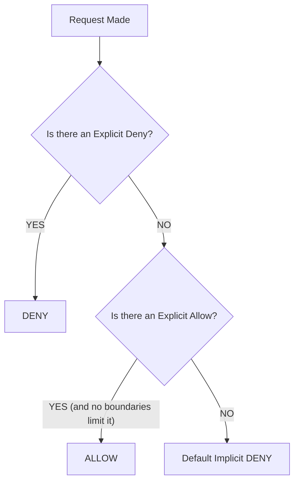

# CHEATSHEET: IAM and Security

## IAM Policy Evaluation Logic

## Policy Types Summary

| Policy Type | Attached To | Purpose | Can Grant Permissions? |
|---|---|---|---|
| **Identity Policy** | User, Group, Role | What can this identity do? | **Yes** |
| **Resource Policy** | S3 Bucket, KMS, SQS | Who can access this resource? | **Yes** (even cross-account) |
| **SCP** | Org, OU, Account | What is the maximum allowed action in this account? | **No** (Only filters) |
| **Permission Boundary** | User, Role | What is the maximum allowed action for this entity? | **No** (Only filters) |

## KMS Key Types

| Key Type | Managed By | Rotation | Cost | Key Policy Control |
|---|---|---|---|---|
| **AWS Owned Key** | AWS (Internal) | Automatic | Free | None |
| **AWS Managed Key** | AWS (`aws/s3`) | Automatic (1 year) | Free | None |
| **Customer Managed** | You | Manual or Auto (1 yr) | $1/month | Full Control |

## S3 Encryption Options

| Method | Who Manages Keys | Requires KMS API Calls? | CloudTrail Audit for Decrypt? |
|---|---|---|---|
| **SSE-S3** | AWS | No | No |
| **SSE-KMS**| You (via KMS) | Yes (costs $) | Yes |
| **SSE-C** | You (Client-side) | No | No (AWS doesn't have the key) |

## Secrets Manager vs Parameter Store

| Feature | Secrets Manager | SSM Parameter Store |
|---|---|---|
| **Cost** | $0.40/secret/month + API | Standard is FREE. Advanced is $0.05/param. |
| **Auto-Rotation**| Built-in (RDS/Aurora integration) | Not built-in (Requires custom Lambda/EventBridge) |
| **Structure** | JSON objects | Simple strings, SecureStrings (KMS), Hierarchical |
| **Cross-Account**| Native support via Resource Policies | No native resource policies |
