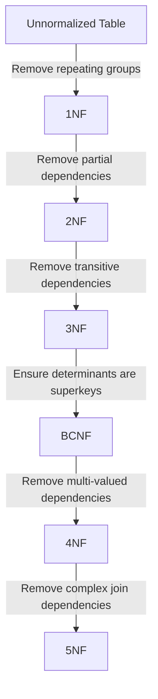

# Relational Normalization Cheatsheet

## Normal Forms Summary

| Normal Form | Rule Requirement | Target Violation to Eliminate |
| :--- | :--- | :--- |
| **1NF** | Atomic values only. No repeating groups. | Non-atomic domains, arrays, nested tables. |
| **2NF** | Must be in 1NF. No partial dependencies. | Non-prime attributes depending on part of a composite key. |
| **3NF** | Must be in 2NF. No transitive dependencies. | Non-prime attributes depending on other non-prime attributes. |
| **BCNF** | Every determinant must be a superkey. | Prime attributes depending on non-superkeys (overlapping keys). |
| **4NF** | Must be in BCNF. No multi-valued dependencies. | Independent 1:N relationships stored in the same table. |
| **5NF** | No complex join dependencies. | Cyclic relationships that require 3+ tables to decompose losslessly. |

---

## Armstrongs Axioms

Let X, Y, and Z be sets of attributes over a relation schema R.

### Primary Axioms
1. **Reflexivity**: If $Y \subseteq X$, then $X \rightarrow Y$
2. **Augmentation**: If $X \rightarrow Y$, then $XZ \rightarrow YZ$
3. **Transitivity**: If $X \rightarrow Y$ and $Y \rightarrow Z$, then $X \rightarrow Z$

### Derived Rules
4. **Union**: If $X \rightarrow Y$ and $X \rightarrow Z$, then $X \rightarrow YZ$
5. **Decomposition**: If $X \rightarrow YZ$, then $X \rightarrow Y$ and $X \rightarrow Z$
6. **Pseudotransitivity**: If $X \rightarrow Y$ and $WY \rightarrow Z$, then $WX \rightarrow Z$

---

## Functional Dependency Closure ($X^+$) Algorithm

To find all attributes functionally determined by attribute set $X$:
1. Initialize $Closure = X$
2. Iterate through all FDs ($A \rightarrow B$):
   - If $A \subseteq Closure$, then $Closure = Closure \cup B$
3. Repeat step 2 until $Closure$ stops changing.
4. If $Closure$ contains all attributes of the relation, $X$ is a superkey.

---

## Decomposition Checks

### Lossless Join Test (For decomposition into $R_1$, $R_2$)
A decomposition is lossless if and only if the intersection of the two schemas is a superkey for at least one of them:
- $(R_1 \cap R_2) \rightarrow R_1$  **OR**
- $(R_1 \cap R_2) \rightarrow R_2$

### Dependency Preservation Test
A decomposition is dependency preserving if:
- $(F_1 \cup F_2 \cup ... \cup F_n)^+ = F^+$
Where $F_i$ is the set of dependencies in relation $R_i$, and $F$ is the original set of dependencies.

---

## PostgreSQL Foreign Key Referential Actions

| Action | Behavior on Parent Deletion/Update | Use Case |
| :--- | :--- | :--- |
| `NO ACTION` (Default) | Raises error, blocks the operation. | Strict integrity required. |
| `RESTRICT` | Same as NO ACTION, but checks cannot be deferred. | Immediate failure required. |
| `CASCADE` | Deletes/Updates the referencing child rows. | Strong entity dependence (Order -> OrderItems). |
| `SET NULL` | Sets the referencing child column to NULL. | Optional associations (Employee -> Department). |
| `SET DEFAULT` | Sets the referencing child column to its default. | Fallback categories exist. |

---

## Normalization Flowchart

