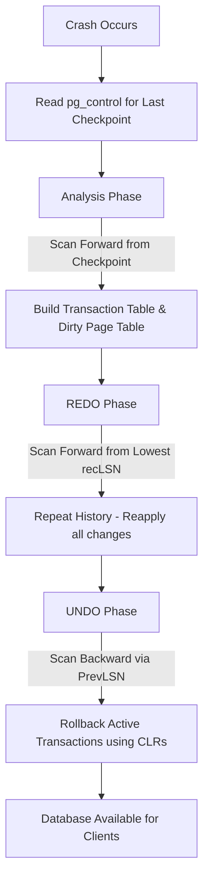

# Module 5: Database Recovery Systems

## 1. Why Recovery Is Needed

Database systems are the source of truth for modern applications. The fundamental requirement of a database management system (DBMS) is to ensure that once a transaction is committed, its effects are durable and persist even in the face of catastrophic failures. This requirement forms the 'D' in the ACID properties: Durability.

Failures in a database environment can broadly be classified into three categories:

1. Transaction Failures: A transaction aborts voluntarily due to a logical error (e.g., insufficient funds) or involuntarily due to a deadlock resolution by the DBMS.
2. System Failures: The database server crashes due to hardware malfunctions (e.g., power loss, kernel panic) or software bugs. The contents of volatile memory (RAM), including the database buffer pool, are lost, but non-volatile storage (disks) remains intact.
3. Media Failures: The physical storage media is corrupted or destroyed. This requires restoring from a backup and replaying archived logs.

To handle these failures, a DBMS employs a recovery manager. The recovery manager guarantees two critical properties:
- Atomicity: Transactions that were in progress at the time of a crash must be completely undone (rolled back) so they leave no partial effects on the database.
- Durability: Transactions that committed before the crash must be completely redone if their modifications were not yet flushed to permanent storage.

Without a robust recovery system, a power outage could leave the database in an inconsistent state, with partial updates violating business rules or data loss affecting critical operations. The recovery system bridges the gap between the volatile buffer pool (designed for performance) and the durable disk storage (designed for persistence).

The buffer pool manager uses a specific policy for writing data to disk, characterized by the Steal and Force principles:
- Steal: Can the DBMS flush uncommitted updates to disk? If yes, it "steals" a frame from an uncommitted transaction. This requires UNDO logging to remove these updates if the transaction later aborts.
- Force: Does the DBMS force all updates of a transaction to disk before it commits? If no, it relies on REDO logging to reapply the updates if a crash occurs before they are flushed.

Modern databases like PostgreSQL use a Steal/No-Force policy because it provides the best performance. It allows large transactions to execute without fitting entirely in memory (Steal) and avoids the massive I/O bottleneck of flushing data pages on every commit (No-Force). The trade-off is the necessity for a sophisticated recovery mechanism, primarily implemented through Write-Ahead Logging.

## 2. Write-Ahead Logging (WAL)

Write-Ahead Logging (WAL) is the standard approach to transaction logging and recovery. The central tenet of WAL is: The log record representing a change to a database page must be written to stable storage before the modified page itself is flushed to disk.

### The WAL Rule

The WAL rule dictates the exact sequencing of I/O operations:
1. When a transaction modifies a page in the buffer pool, a corresponding log record is created in the WAL buffer.
2. Before the buffer pool manager can evict the dirty page and write it to the data file on disk, it must ensure that all WAL records up to and including the one describing this modification have been flushed to the WAL file on disk.
3. When a transaction commits, its commit log record must be flushed to the WAL file on disk before the transaction is acknowledged as successful to the client. The actual data pages do not need to be flushed immediately.

### Anatomy of a Log Record

A typical WAL record contains:
- Log Sequence Number (LSN): A globally unique, monotonically increasing identifier for the log record. In PostgreSQL, this represents the physical byte offset in the WAL stream.
- Transaction ID (XID): The identifier of the transaction performing the modification.
- Page ID: The physical location (Tablespace, Database, Relation, Block Number) of the modified page.
- PrevLSN: The LSN of the previous log record written by the same transaction, forming a backward linked list for efficient UNDO.
- REDO Data: The information required to reapply the change (often the after-image or the exact operation).
- UNDO Data: The information required to revert the change (the before-image or the inverse operation).

### PostgreSQL WAL Implementation

In PostgreSQL, WAL files are stored in the `pg_wal` (formerly `pg_xlog`) directory. Each file (WAL segment) is typically 16MB in size. 

Here is how you can inspect the current WAL LSN using SQL:

```sql
-- Get the current insert WAL LSN
SELECT pg_current_wal_insert_lsn();

-- Get the current flush WAL LSN (what is safely on disk)
SELECT pg_current_wal_flush_lsn();

-- Calculate the difference in bytes between two LSNs
SELECT pg_wal_lsn_diff('0/1A2B3C4D', '0/1A2B3A00');
```

The difference between the insert LSN and flush LSN represents the amount of unwritten WAL data in the volatile buffer. The background writer (bgwriter) and the WAL writer processes work continuously to flush this data to disk efficiently.

By deferring random I/O (writing scattered data pages) in favor of sequential I/O (appending to the WAL file), the DBMS achieves high throughput. The WAL acts as the definitive source of truth; as long as the WAL is safe, the database state can be reconstructed.

## 3. Checkpoints

While WAL ensures durability, it creates a practical problem: recovery time. If a database runs for months without crashing, the WAL stream becomes enormous. To recover from a crash, the DBMS would theoretically need to replay the WAL from the very beginning, which could take days.

Checkpoints solve this problem by bounding the recovery time. A checkpoint is a synchronized state where the DBMS ensures that all data modified up to a certain point in the WAL has been safely written to the main data files.

### The Checkpoint Process

When a checkpoint is triggered, the following operations occur:
1. The DBMS writes a `BEGIN CHECKPOINT` record to the WAL.
2. It identifies all dirty pages currently in the buffer pool.
3. It writes all these dirty pages to their respective data files on disk.
4. It calls `fsync()` on the data files to ensure the OS has physically flushed them to the storage media.
5. It writes an `END CHECKPOINT` record to the WAL, containing the LSN of the `BEGIN CHECKPOINT` record.
6. It updates a special control file (in PostgreSQL, `pg_control`) to store the LSN of the latest successful checkpoint.

During crash recovery, the DBMS reads the control file to find the last checkpoint LSN. It knows that all data modifications prior to this LSN are already safely on disk in the data files. Therefore, it only needs to replay the WAL starting from this checkpoint LSN, drastically reducing recovery time.

### PostgreSQL Checkpoint Configuration

PostgreSQL allows fine-tuning of checkpoint behavior to balance performance and recovery time. If checkpoints happen too frequently, the I/O overhead of flushing dirty pages degrades performance. If they happen too infrequently, crash recovery takes too long.

Key parameters in `postgresql.conf`:

```ini
# Maximum time between automatic WAL checkpoints
checkpoint_timeout = 5min 

# Maximum total size of WAL files that will trigger a checkpoint
max_wal_size = 1GB

# Target time for checkpoint completion, as a fraction of checkpoint_timeout.
# 0.9 spreads the I/O over 90% of the timeout interval to avoid I/O spikes.
checkpoint_completion_target = 0.9

# Forces a checkpoint if the WAL directory exceeds this size
min_wal_size = 80MB
```

In PostgreSQL, a checkpoint is triggered if either `checkpoint_timeout` is reached OR the WAL volume reaches `max_wal_size`. The `checkpoint_completion_target` is crucial; it instructs PostgreSQL to write the dirty pages slowly, spreading the I/O load over the checkpoint interval, rather than causing an "I/O storm" that freezes the system.

You can manually trigger a checkpoint in PostgreSQL using:

```sql
CHECKPOINT;
```

## 4. Recovery Process (ARIES Algorithm)

ARIES (Algorithm for Recovery and Isolation Exploiting Semantics) is the state-of-the-art recovery algorithm developed by IBM. Almost all modern relational databases use variants of ARIES. It operates on the Steal/No-Force buffer management policy and uses WAL.

ARIES recovery consists of three distinct phases executed sequentially after a crash: Analysis, REDO, and UNDO.

### Phase 1: Analysis

The goal of the Analysis phase is to reconstruct the state of the database at the exact moment of the crash. It determines the starting point for the REDO phase and identifies which transactions were active and need to be rolled back.

1. The DBMS reads the `pg_control` file to find the LSN of the last successful `BEGIN CHECKPOINT`.
2. It scans the WAL forward from that checkpoint LSN to the end of the log.
3. It maintains two critical data structures in memory:
   - Transaction Table (TT): Tracks the state of all active transactions (XID, Status, LastLSN).
   - Dirty Page Table (DPT): Tracks all pages that were dirty in the buffer pool (PageID, recLSN). The `recLSN` (Recovery LSN) is the LSN of the log record that first caused the page to become dirty since it was last flushed.

If it encounters a `COMMIT` or `ABORT` record, it removes the transaction from the TT. If it encounters a modification record for a page not in the DPT, it adds the page to the DPT with the record's LSN as the `recLSN`.

### Phase 2: REDO

The REDO phase reapplies all changes that were made before the crash but might not have been flushed to the data files. This restores the database exactly to the state it was in right before the crash, including the changes made by transactions that eventually failed. This principle is called "Repeating History."

1. The REDO phase starts scanning the WAL forward from the lowest `recLSN` found in the DPT during the Analysis phase. This is the oldest update that might not be on disk.
2. For every log record encountered, ARIES checks if the modification needs to be reapplied. It skips REDO if:
   - The page is not in the DPT.
   - The record's LSN is less than the page's `recLSN` in the DPT.
   - The page's LSN on disk is greater than or equal to the record's LSN (this requires reading the page from disk to check its header).
3. If REDO is required, the DBMS reapplies the logged change to the page and updates the page's LSN.

By the end of the REDO phase, the database physically matches the exact state at the moment of the crash.

### Phase 3: UNDO

The UNDO phase reverses the effects of all transactions that were active at the time of the crash (the "loser" transactions left in the Transaction Table after the Analysis phase).

1. The DBMS scans the WAL backward. It uses the `PrevLSN` pointer in the log records to trace back through the operations of each loser transaction.
2. For each modification log record belonging to a loser transaction, the DBMS applies the UNDO data to reverse the change.
3. Crucially, ARIES logs these UNDO operations using Compensation Log Records (CLRs). A CLR ensures that if the system crashes again during the UNDO phase, the DBMS does not attempt to undo an operation that has already been undone. A CLR contains an `UndoNextLSN` pointer, which skips over the undone operation.
4. Once a transaction is completely undone, an `ABORT` record is written.

### Mermaid Diagram of ARIES Phases



## 5. PostgreSQL Backup Strategies

While crash recovery handles sudden power losses, media failures (disk death, accidental `DROP TABLE`) require external backups. PostgreSQL offers three main backup paradigms.

### 5.1 Logical Backups (`pg_dump`)

`pg_dump` extracts the database into a script file or archive containing SQL commands (`CREATE TABLE`, `INSERT`, etc.) required to reconstruct the database.

- Pros: Cross-version compatibility, cross-architecture compatibility, allows restoring single tables, highly compressible.
- Cons: Slow to create, very slow to restore (must rebuild indexes from scratch), does not include cluster-wide objects like roles unless `pg_dumpall` is used.

```bash
# Dump a database in custom format (compressed, supports parallel restore)
pg_dump -U postgres -F c -f mydb_backup.dump mydb

# Restore the custom format backup using 4 parallel jobs
pg_restore -U postgres -j 4 -d mydb mydb_backup.dump
```

### 5.2 Physical Backups (`pg_basebackup`)

`pg_basebackup` makes a binary copy of the cluster's data files. It is the foundation for replication and point-in-time recovery.

- Pros: Fast to create (just copying files), extremely fast to restore (files are already in the correct format, indexes exist), includes all databases and roles.
- Cons: Tied to the specific major version and architecture of PostgreSQL, cannot restore individual tables.

```bash
# Take a base backup, stream the WAL needed to make it consistent, and compress it
pg_basebackup -h localhost -U replicator -D /backup/base/ -F p -X stream -P -z
```

### 5.3 Point-In-Time Recovery (PITR)

PITR combines a physical base backup with continuous WAL archiving. It allows you to restore the database to its exact state at any microsecond in the past, right up to the moment someone accidentally dropped a critical table.

**Steps to configure PITR:**
1. Enable WAL archiving in `postgresql.conf`:
```ini
wal_level = replica
archive_mode = on
archive_command = 'cp %p /mnt/wal_archive/%f'
```
2. Take a base backup using `pg_basebackup`.
3. Allow the system to run and accumulate archived WAL files.

**Steps to execute PITR:**
1. Stop the PostgreSQL server.
2. Delete the current contents of the data directory (but keep `pg_wal` if it contains unarchived segments).
3. Restore the base backup into the data directory.
4. Create a `recovery.signal` file in the data directory.
5. Configure recovery settings in `postgresql.conf`:
```ini
restore_command = 'cp /mnt/wal_archive/%f %p'
recovery_target_time = '2023-10-27 14:30:00 UTC'
```
6. Start the server. PostgreSQL will read the base backup, then sequentially apply the archived WAL files until it reaches exactly the target time, at which point it opens the database for connections.

## 6. Replication

Replication is the process of copying data from a primary server to one or more standby servers. It serves two purposes: High Availability (failover if the primary dies) and Read Scaling (offloading `SELECT` queries).

### Streaming Replication (Physical)

Streaming replication ships the raw WAL stream from the primary to the standby. The standby is essentially continuously executing the ARIES REDO phase. Because it copies physical disk blocks, the standby is an exact byte-for-byte clone of the primary.

- Setup: Requires configuring `primary_conninfo` on the standby and creating a replication role on the primary.
- Use Case: High Availability, exact disaster recovery replicas.

You can monitor streaming replication using:
```sql
-- Run on Primary
SELECT client_addr, state, sync_state, 
       pg_wal_lsn_diff(pg_current_wal_lsn(), replay_lsn) AS lag_bytes 
FROM pg_stat_replication;

-- Run on Standby
SELECT status, receive_start_lsn, last_msg_receipt_time 
FROM pg_stat_wal_receiver;
```

### Logical Replication

Logical replication decodes the WAL into higher-level statements (e.g., "Insert this row into Table X") and sends them to the subscriber. It operates on a publication/subscription model.

- Pros: Can replicate between different PostgreSQL major versions, can replicate specific tables instead of the whole cluster, subscriber can be writable.
- Setup:
```sql
-- On Publisher (Primary)
CREATE PUBLICATION mypub FOR TABLE users, orders;

-- On Subscriber
CREATE SUBSCRIPTION mysub CONNECTION 'dbname=mydb host=primary_host' PUBLICATION mypub;
```

### Synchronous vs. Asynchronous Replication

By default, replication is asynchronous. The primary commits the transaction, acknowledges the client, and then sends the WAL to the standby. If the primary crashes immediately after acknowledging the client, the standby might not have received the WAL, leading to data loss during failover.

Synchronous replication guarantees that a transaction is not acknowledged to the client until it has been safely written to the standby's disk.

```ini
# postgresql.conf on Primary
synchronous_commit = on
synchronous_standby_names = 'FIRST 1 (standby1, standby2)'
```

Setting `synchronous_commit` to `on` provides zero RPO (Recovery Point Objective) but introduces latency, as every commit must wait for a network round-trip to the standby.

## 7. High Availability Patterns

High Availability (HA) systems automate the process of detecting a primary failure and promoting a standby to become the new primary, minimizing downtime (RTO - Recovery Time Objective).

### RTO and RPO

- RPO (Recovery Point Objective): The maximum acceptable amount of data loss measured in time. (e.g., "We can lose at most 5 minutes of data"). Synchronous replication achieves RPO = 0.
- RTO (Recovery Time Objective): The maximum acceptable duration of downtime. (e.g., "The system must be back online within 30 seconds"). Automated failover tools minimize RTO.

### Patroni Architecture

Patroni is the industry standard for PostgreSQL HA. Developed by Zalando, it uses a Distributed Configuration Store (DCS) like etcd, Consul, or ZooKeeper to maintain consensus about the cluster state.

1. Each PostgreSQL node runs a Patroni agent.
2. The agents constantly send heartbeats to the DCS.
3. The DCS holds a "leader lock". Only the primary node can hold the leader lock.
4. If the primary dies, its heartbeat stops, and the DCS leader lock expires.
5. The remaining standbys race to acquire the lock. Patroni checks their WAL LSNs to ensure only the most up-to-date standby can win the election.
6. The winning standby promotes itself to primary and acquires the lock.
7. The other standbys automatically reconfigure their `primary_conninfo` to point to the new primary.
8. Connection routing is handled via HAProxy (which polls Patroni's REST API to find the current leader) or a virtual IP (VIP) managed by Patroni.

### pg_auto_failover

An alternative developed by Citus Data (Microsoft). Instead of requiring a full DCS cluster like etcd, it uses a third PostgreSQL instance called the "Monitor" node. The Monitor tracks the health of the primary and secondary and dictates state changes. It is simpler to set up than Patroni but puts a single point of failure on the Monitor node (though the data is still safe if the Monitor dies, automatic failover just stops working).

### Replication Slots

A major danger in replication is the primary recycling WAL files before the standby has received them (e.g., if the standby disconnects for an hour). If this happens, the standby is permanently broken and must be rebuilt via `pg_basebackup`.

Replication slots solve this. When a standby creates a replication slot on the primary, it registers its current LSN. The primary is mathematically forbidden from deleting any WAL files that the standby still needs, regardless of `max_wal_size`.

```sql
-- Create a physical replication slot
SELECT pg_create_physical_replication_slot('standby_slot_1');
```

**Warning**: If a standby goes offline permanently and its replication slot is not manually dropped, the primary will retain WAL files infinitely until its disk fills up completely, causing a cluster-wide crash. Monitoring `pg_replication_slots` is critical for production DBAs.

```sql
-- Monitor replication slots and retained WAL size
SELECT slot_name, plugin, slot_type, active, 
       pg_wal_lsn_diff(pg_current_wal_lsn(), restart_lsn) AS retained_bytes
FROM pg_replication_slots;
```

## 8. Advanced WAL Configurations

In mission-critical enterprise environments, WAL configuration extends far beyond `archive_mode`. Administrators must carefully balance durability, write throughput, and disk space.

### Full Page Writes

During a checkpoint, if the OS crashes precisely while writing a PostgreSQL 8KB data page to disk, the page might become torn (partially written, containing a mix of old and new data). Standard WAL records (which only log the delta, not the whole page) cannot repair a torn page because they assume a valid starting state.

To prevent this, PostgreSQL uses `full_page_writes = on` (default). After every checkpoint, the very first time a page is modified, PostgreSQL writes a complete copy of the 8KB page into the WAL before logging the delta.

```ini
# Essential for data integrity on standard file systems.
full_page_writes = on
```

While safe, full page writes dramatically inflate the volume of WAL generated immediately after a checkpoint. This leads to the phenomenon of "WAL spikes." File systems like ZFS, which guarantee atomic page writes (preventing torn pages), allow DBAs to safely set `full_page_writes = off`, significantly reducing write amplification.

### The WAL Writer Process

The WAL writer background process is responsible for periodically flushing the WAL buffer to disk independently of committing transactions (useful when `synchronous_commit = off`).

```ini
# Sleep time between flushes
wal_writer_delay = 200ms

# How much WAL must be written before forcing a flush
wal_writer_flush_after = 1MB
```

## 9. Recovery from Corrupted Disks

When hardware corruption strikes, standard crash recovery may fail if the physical data files or the WAL files themselves contain invalid data.

### pg_checksums

By default, in modern versions, PostgreSQL can enable page-level checksums at `initdb` time. If enabled, every time a page is read from disk into the buffer pool, its checksum is verified. If corruption is detected, the database immediately halts the operation, preventing corrupted data from spreading.

```bash
# Check if checksums are enabled on an offline cluster
pg_checksums -D /var/lib/postgresql/data -c
```

If a page is corrupted, but you have a physical backup and WAL archives, you can theoretically patch the corrupted page using advanced internal tools, but the standard protocol is to execute a Point-In-Time Recovery to a moment before the corruption occurred.

### pg_waldump

To debug replication issues, or analyze exactly what transactions are filling up the disk, DBAs use `pg_waldump`. This utility translates binary WAL files into human-readable text.

```bash
# Dump the contents of a specific WAL file
pg_waldump 000000010000000000000001
```

You can see exact block references, XIDs, and the LSN boundaries of transactions.

## 10. Logical Decoding Internals

Logical decoding is the engine underlying logical replication. It hooks into the transaction log (WAL) and extracts the stream of operations in a logical, rather than physical, format.

When logical replication is enabled (`wal_level = logical`), the WAL contains additional metadata to map physical block changes back to their logical table and row identifiers. 

The `wal2json` or `pgoutput` output plugins read this enriched WAL, skip rolled-back transactions (since they never logically committed), and emit a stream of JSON or binary changes. This is widely used in CDC (Change Data Capture) systems like Debezium.

## 11. Advanced Disaster Recovery Drills

A recovery system is only as good as its last successful test. Routine disaster recovery (DR) drills are mandatory.

### Simulating a Split-Brain Scenario

Split-brain occurs when two nodes in an HA cluster both believe they are the primary, leading to diverging data histories. A robust DR drill should intentionally cause a network partition between the primary and the DCS (e.g., etcd in Patroni) using `iptables` to drop traffic.
1. Apply the network partition.
2. Verify the primary demotes itself upon losing the leader lock.
3. Verify a standby promotes itself.
4. Remove the partition.
5. Verify the old primary gracefully rejoins as a standby, using `pg_rewind` if its timeline diverged slightly before it detected the lock loss.

### Testing PITR Granularity

Administrators should regularly restore production data to a staging environment using a highly specific PITR timestamp.
1. Insert a canary row into a test table and log its exact commit timestamp.
2. Immediately drop the table.
3. Perform a PITR targeting 1 millisecond before the DROP command.
4. Verify the canary row exists in the restored database.

## 12. PostgreSQL Timelines and pg_rewind

When a failover occurs and a standby is promoted, PostgreSQL increments its "Timeline ID." This prevents the old primary (if it wakes up) from accidentally appending old WAL data to the new primary's WAL stream.

If the old primary had committed transactions that were *not* replicated to the standby before the crash, its data files now contain a divergent timeline. Traditionally, the old primary would have to be wiped and rebuilt from scratch via `pg_basebackup`.

`pg_rewind` is a utility that synchronizes a PostgreSQL data directory with another PostgreSQL data directory that was branched from it. It works by:
1. Scanning the WAL of the new primary to find the exact point where the timelines diverged.
2. Reading only the data blocks on the old primary that changed *after* that point.
3. Overwriting those specific blocks with the correct blocks fetched from the new primary.

This allows a demoted primary to rejoin the cluster as a standby in seconds, rather than the hours it might take to perform a full `pg_basebackup`.

```bash
# Rewind an old primary to match the new primary
pg_rewind --target-pgdata=/var/lib/postgresql/data --source-server='host=new_primary port=5432 user=postgres'
```

## 13. Security Considerations During Backup

Backups are a massive exfiltration risk. If an attacker gains access to your S3 bucket containing physical base backups and WAL archives, they have the entire database.

### Transparent Data Encryption (TDE)

While native PostgreSQL TDE is still evolving, many organizations rely on file-system level encryption (LUKS) or storage-level encryption (AWS KMS for EBS/S3). When performing `pg_basebackup`, the data is transmitted in the clear unless TLS is enforced.

### Encrypting pg_dump output

When using logical backups, you can pipe the output directly through an encryption utility like GPG before it ever hits the disk.

```bash
# Dump, compress, and encrypt on the fly
pg_dump mydb | gzip | gpg -c -o mydb_backup.sql.gz.gpg
```

This ensures that even if the backup file is stolen, it cannot be read without the decryption passphrase.

## 14. Extensive Glossary of Recovery Terms

- **ACID**: Atomicity, Consistency, Isolation, Durability. The core properties of a reliable database transaction.
- **ARIES**: Algorithm for Recovery and Isolation Exploiting Semantics. The standard recovery algorithm.
- **Buffer Pool**: The area of RAM where the DBMS caches database pages to avoid disk I/O.
- **Checkpoint**: A synchronized point where all dirty pages are flushed to disk, bounding recovery time.
- **CLR**: Compensation Log Record. A WAL record written during the UNDO phase of crash recovery to prevent repeated rollbacks.
- **DCS**: Distributed Configuration Store. A consensus system (etcd, Consul) used by HA tools like Patroni.
- **DPT**: Dirty Page Table. An in-memory data structure used during ARIES analysis tracking unwritten pages.
- **LSN**: Log Sequence Number. A 64-bit integer representing a specific byte position in the WAL stream.
- **pg_control**: A critical binary file that stores cluster state, including the last checkpoint LSN.
- **pg_rewind**: A tool to resynchronize a divergent PostgreSQL cluster without a full base backup.
- **PITR**: Point-In-Time Recovery. Replaying WAL archives to restore the database to an exact historical microsecond.
- **REDO**: Reapplying a logged transaction to restore changes made before a crash.
- **RPO**: Recovery Point Objective. The maximum acceptable data loss in time.
- **RTO**: Recovery Time Objective. The maximum acceptable downtime during a failure.
- **Steal/No-Force**: The standard buffer pool management policy. Steal means dirty frames can be evicted before commit. No-Force means committed frames don't have to be flushed immediately.
- **Synchronous Commit**: A setting that blocks transaction acknowledgment until the WAL is written to a standby node.
- **TT**: Transaction Table. An in-memory data structure tracking active transactions during crash recovery.
- **UNDO**: Reverting a logged transaction that did not commit before a crash.
- **WAL**: Write-Ahead Log. The append-only transaction log that guarantees durability.
- **WAL Segment**: A physical file (usually 16MB) that stores a portion of the continuous WAL stream.

## Summary

Recovery systems are the safety net of the database. Understanding the interplay between the Buffer Pool Manager, the WAL, and Checkpoints is essential for database engineering. ARIES provides the theoretical foundation for crash recovery, while tools like Patroni, `pg_dump`, and replication protocols provide the practical mechanisms for scaling, disaster recovery, and high availability in modern PostgreSQL deployments. Mastering these concepts ensures that user data is never lost, regardless of hardware or software failures.

### Section: Replication Slots
```sql
-- Physical slot: retains WAL until standby has consumed it
SELECT pg_create_physical_replication_slot('standby1_slot');

-- Logical slot: retains WAL for logical decoding
SELECT pg_create_logical_replication_slot('my_slot', 'pgoutput');

-- View all slots and retained WAL
SELECT slot_name, slot_type, active, restart_lsn,
       pg_size_pretty(pg_wal_lsn_diff(pg_current_wal_lsn(), restart_lsn)) AS retained_wal
FROM pg_replication_slots;

-- DANGER: inactive slot retains ALL WAL since restart_lsn
-- This fills pg_wal/ and crashes the server when disk is full
-- Alert when retained WAL > 10GB:
SELECT slot_name,
       pg_wal_lsn_diff(pg_current_wal_lsn(), restart_lsn) AS retained_bytes
FROM pg_replication_slots
WHERE pg_wal_lsn_diff(pg_current_wal_lsn(), restart_lsn) > 10 * 1024 * 1024 * 1024;

-- Drop unused slot:
SELECT pg_drop_replication_slot('unused_slot');
```

Monitoring best practices:
- Always set an alert on inactive replication slots that are retaining WAL
- At minimum: monitor `pg_replication_slots.active` and `restart_lsn` age
- In high-traffic databases, an inactive slot can retain 100GB+ of WAL within hours
- Production rule: if a slot is inactive for more than 1 hour, drop it and recreate when needed

### Section: Read Replicas and Load Balancing
```sql
-- Hot standby: replica accepts read-only queries while replaying WAL
-- postgresql.conf on replica: hot_standby = on (default in PG 10+)

-- Check if this instance is primary or standby:
SELECT pg_is_in_recovery();  -- false = primary, true = standby

-- Check replication lag on standby:
SELECT
  now() - pg_last_xact_replay_timestamp() AS replication_lag,
  pg_last_wal_replay_lsn() AS replay_lsn,
  pg_last_wal_receive_lsn() AS receive_lsn,
  CASE WHEN receive_lsn = replay_lsn THEN 'caught up'
       ELSE 'lagging' END AS status
FROM (
  SELECT pg_last_wal_receive_lsn() AS receive_lsn,
         pg_last_wal_replay_lsn()  AS replay_lsn
) t;
```

Read replica use cases:
1. Offload heavy analytical / reporting queries from the primary (avoid competing with OLTP)
2. Geographic replicas: deploy replica in region closest to read-heavy users
3. Backup source: run `pg_dump` against replica to avoid loading the primary
4. Development/staging: developers query replica instead of production primary

Load balancing patterns:
- **Application-level**: app chooses primary for writes, replica for reads explicitly
- **HAProxy**: uses a health check endpoint (`pg_is_in_recovery()`) to route writes to primary, reads to replicas
- **PgBouncer**: separate named pools — `app` (primary) and `app_readonly` (replica)
- **Patroni REST API**: exposes `/primary`, `/replica`, `/health` endpoints for HAProxy health checks

### Section: Failover Procedures
```bash
# Manual promotion (planned failover / switchover)

# Step 1: On primary, verify standby is caught up
psql -h primary -c "SELECT client_addr, sent_lsn, replay_lsn,
  pg_wal_lsn_diff(sent_lsn, replay_lsn) AS lag_bytes
  FROM pg_stat_replication;"

# Step 2: Stop primary cleanly (allows all WAL to reach standby)
pg_ctl stop -D $PGDATA -m fast

# Step 3: Promote standby
pg_ctl promote -D $PGDATA_STANDBY
# Or: touch $PGDATA_STANDBY/failover.signal

# Step 4: Verify promotion
psql -h new_primary -c "SELECT pg_is_in_recovery();"  -- must return false
psql -h new_primary -c "SELECT pg_current_wal_lsn();"

# Step 5: Update application connection string (or let HAProxy/Patroni handle it)

# Step 6: Resync old primary as new standby using pg_rewind
pg_rewind --target-pgdata=$PGDATA_OLD_PRIMARY \
          --source-server='host=new_primary user=replicator dbname=postgres'
# pg_rewind copies only the changed blocks (much faster than pg_basebackup)
```

Patroni automatic failover timeline:
1. Primary crashes or loses network
2. Patroni's health check fails after `loop_wait` seconds (default 10s)
3. Primary's leader key in etcd expires after TTL (default 30s)
4. All standbies race to acquire the leader key
5. Standby with highest `replay_lsn` wins (checked via DCS)
6. Winner promotes itself and updates etcd with new primary info
7. Other standbies receive new primary info, start streaming from it
8. HAProxy detects new primary via health check endpoint, updates routing
9. Total: typically 30-60 seconds end-to-end downtime

### Section: Backup Best Practices
```bash
# WAL-G: recommended modern backup tool
# Supports S3, GCS, Azure, local

export WALG_S3_PREFIX=s3://company-backups/postgres/prod
export AWS_REGION=ap-south-1

# Full backup:
wal-g backup-push $PGDATA

# Configure archiving:
# postgresql.conf:
# archive_mode = on
# archive_command = 'wal-g wal-push %p'
# restore_command = 'wal-g wal-fetch %f %p'
# archive_timeout = 300  # force WAL switch every 5 minutes (max 5-min data loss)

# List available backups:
wal-g backup-list DETAIL

# Restore latest backup + replay WAL to specific time:
wal-g backup-fetch $PGDATA LATEST
cat >> $PGDATA/postgresql.conf << 'EOF'
restore_command = 'wal-g wal-fetch %f %p'
recovery_target_time = '2024-09-10 14:30:00+05:30'
recovery_target_action = 'promote'
EOF
touch $PGDATA/recovery.signal
pg_ctl start -D $PGDATA

# Retention: keep 7 full backups
wal-g delete --confirm retain FULL 7

# NEVER trust untested backups:
# Weekly: restore to a throwaway instance and run SELECT COUNT(*) checks
# Monthly: full application-level restore test

# Monitor archive health:
SELECT last_archived_wal, last_archived_time, last_failed_wal, last_failed_time,
       archived_count, failed_count
FROM pg_stat_archiver;
-- Alert if: last_failed_time > last_archived_time
```
