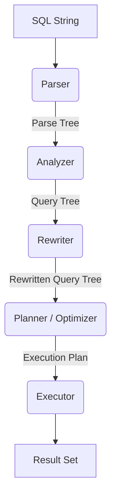

# Module 6: Query Optimization in PostgreSQL

Query optimization is the process of defining the most efficient execution plan for a given SQL statement. A relational database system like PostgreSQL separates the "what" (the logical SQL query) from the "how" (the physical execution path). Because data sizes, hardware limits, and system configurations vary wildly, selecting the correct physical execution path is crucial. A poor query plan can cause a database to scan billions of rows needlessly, exhaust memory, and drag down the entire application infrastructure.

In this module, we will dive exceptionally deep into the PostgreSQL query processing pipeline, investigate execution plans using EXPLAIN and EXPLAIN ANALYZE, mathematically dissect join algorithms, study the statistical planner, and look at advanced architectural patterns like partitioning and materialized views to scale large datasets.

We will provide extensive examples, cost calculations, and architectural diagrams. Read this module carefully, test the examples on a live PostgreSQL database, and understand the internal mechanics. Let us begin.

---

## 1. The Query Processing Pipeline

When an application sends a query over the network to the PostgreSQL server, it does not execute immediately. It passes through a robust, multi-stage pipeline designed to parse, analyze, rewrite, plan, and finally execute the statement.

### Stage 1: Parsing
The raw SQL string is fed into the Parser. The Parser consists of a lexer (which breaks the string into tokens) and a parser (which validates the grammatical structure against the SQL dialect). If you misspell a keyword (e.g., `SELEC` instead of `SELECT`), the query fails here. The output is a "Parse Tree," a logical representation of the syntactic structure.

### Stage 2: Analysis (Semantic Validation)
The Analyzer takes the Parse Tree and performs semantic validation. It checks the system catalogs to ensure the tables and columns referenced actually exist. It validates data types and determines if the requested operations are valid (e.g., you cannot divide a string by an integer). The output is a "Query Tree."

### Stage 3: Rewriting
The Rewriter processes the Query Tree by applying predefined rules. The most common use case is Views. A View does not physically store data; it stores a query. When you select from a view, the Rewriter intercepts the Query Tree and expands the view definition into the base tables. 

### Stage 4: Planning / Optimization
This is the heart of the database engine. The Planner takes the Query Tree and generates a physical "Execution Plan." Because SQL is declarative, there can be thousands of valid execution paths for a complex query.
- Should it scan the table sequentially or use an index?
- Should it read table A and join it to table B, or read table B and join it to A?
- Should it use a Hash Join or a Nested Loop Join?

The Planner relies on a cost-based optimizer (CBO). It generates many possible execution plans, assigns a mathematical cost to each based on table statistics and hardware constants, and selects the plan with the lowest cost. The cost is an arbitrary unit representing disk I/O and CPU effort.

### Stage 5: Execution
The Executor takes the optimal plan and evaluates it. Plans are structured as an inverted tree of "Nodes" (e.g., Index Scan Node, Hash Join Node). The execution model is "pull-based" (the Volcano model). The root node asks its child nodes for a row, the children ask their children, down to the leaf nodes which fetch data from the buffer cache or disk.



---

## 2. EXPLAIN and EXPLAIN ANALYZE

To optimize queries, you must be able to read the execution plans generated by the Planner. PostgreSQL provides the `EXPLAIN` command for this purpose.

### The `EXPLAIN` Command
Prepending `EXPLAIN` to a SQL statement returns the plan without actually running the query.

```sql
EXPLAIN 
SELECT * FROM users WHERE last_login > '2023-01-01';
```

Example Output:
```text
                             QUERY PLAN
--------------------------------------------------------------------
 Seq Scan on users  (cost=0.00..18334.00 rows=450000 width=128)
   Filter: (last_login > '2023-01-01'::date)
```

**Understanding the Output:**
- `Seq Scan on users`: The node type. It is performing a sequential scan (reading the table from beginning to end).
- `cost=0.00..18334.00`: The cost estimate. 
  - `0.00` is the startup cost (the cost before the first row is returned).
  - `18334.00` is the total cost (the cost to return all rows).
- `rows=450000`: The planner estimates 450,000 rows will match the condition.
- `width=128`: The estimated average size of each returned row in bytes.

### The Cost Math
The cost is calculated using configuration parameters found in `postgresql.conf`:
- `seq_page_cost`: Cost of a sequential disk page read (default 1.0).
- `random_page_cost`: Cost of a non-sequential disk page read (default 4.0).
- `cpu_tuple_cost`: Cost of processing each row (default 0.01).
- `cpu_operator_cost`: Cost of executing an operator or function (default 0.0025).

Let's assume the `users` table has 10,000 pages and 1,000,000 tuples (rows).
- Page fetch cost = 10,000 pages * 1.0 = 10,000
- Tuple processing cost = 1,000,000 rows * 0.01 = 10,000
- Filter execution cost = 1,000,000 rows * 0.0025 = 2,500
Total Seq Scan Cost = 10,000 + 10,000 + 2,500 = 22,500.

### The `EXPLAIN ANALYZE` Command
While `EXPLAIN` provides estimates, `EXPLAIN ANALYZE` executes the query and provides actual runtime statistics. This is critical for finding discrepancies between the planner's estimates and reality.

```sql
EXPLAIN ANALYZE 
SELECT * FROM users WHERE last_login > '2023-01-01';
```

Example Output:
```text
                             QUERY PLAN
--------------------------------------------------------------------------------------------------------
 Seq Scan on users  (cost=0.00..18334.00 rows=450000 width=128) (actual time=0.022..145.330 rows=480210 loops=1)
   Filter: (last_login > '2023-01-01'::date)
   Rows Removed by Filter: 519790
 Planning Time: 0.150 ms
 Execution Time: 160.200 ms
```

**Key Additions:**
- `actual time=0.022..145.330`: Time in milliseconds. The first row took 0.022ms, all rows took 145.330ms.
- `rows=480210`: The *actual* number of rows returned. (Very close to the estimate of 450,000).
- `loops=1`: How many times this node was executed.
- `Rows Removed by Filter`: Shows the wasted effort of the sequential scan.

### The `BUFFERS` Option
You should almost always use `EXPLAIN (ANALYZE, BUFFERS)` to see memory and disk I/O.

```sql
EXPLAIN (ANALYZE, BUFFERS) 
SELECT * FROM users WHERE id = 12345;
```

```text
                             QUERY PLAN
--------------------------------------------------------------------------------------------------------
 Index Scan using users_pkey on users  (cost=0.42..8.44 rows=1 width=128) (actual time=0.015..0.016 rows=1 loops=1)
   Index Cond: (id = 12345)
   Buffers: shared hit=4
 Planning Time: 0.080 ms
 Execution Time: 0.035 ms
```
- `shared hit=4`: The query accessed 4 blocks (32KB), and all of them were already cached in memory (hits). If data had to be read from disk, you would see `read=...`.

### EXPLAIN Output Formats
By default, EXPLAIN returns text. For automated tooling or deeper analysis via tools like Depesz or Dalibo, JSON output is preferred.

```sql
EXPLAIN (ANALYZE, FORMAT JSON) 
SELECT COUNT(*) FROM users;
```

---

## 3. Join Algorithms

When a query joins two or more tables, PostgreSQL must decide how to physically combine the rows. The planner chooses between three primary algorithms: Nested Loop, Hash Join, and Merge Join. Understanding how these work internally is paramount for query optimization.

### 3.1. Nested Loop Join
The nested loop join is the simplest algorithm. It requires two relations: an "outer" table and an "inner" table. For every single row in the outer table, it loops through the inner table looking for a match.

**Pseudocode:**
```python
for outer_row in outer_table:
    for inner_row in inner_table:
        if outer_row.key == inner_row.key:
            yield (outer_row, inner_row)
```

**Complexity:** O(N * M), where N is outer rows and M is inner rows.

**When is it used?**
Nested loops are highly efficient when the outer table is very small (e.g., filtered down to a few rows via a WHERE clause), and the inner table has an index on the join key. 

If we join a 10-row dataset to a 10-million row table using an index, the nested loop performs 10 index lookups. Extremely fast. However, if both tables have 1 million rows and no indexes, a nested loop requires 1 trillion comparisons. The planner will actively avoid nested loops for large datasets.

```sql
-- Example where Nested Loop is optimal
EXPLAIN ANALYZE
SELECT o.id, c.name
FROM orders o
JOIN customers c ON o.customer_id = c.id
WHERE o.created_at >= CURRENT_DATE;
```
If only 50 orders were placed today, the outer loop has 50 rows. 50 index lookups on the customers table is virtually instantaneous.

### 3.2. Hash Join
The Hash Join is the workhorse for joining large, unsorted datasets. It operates in two phases: the Build phase and the Probe phase.

**Phase 1: Build**
PostgreSQL selects the smaller of the two tables to be the inner table. It scans this table and hashes the join key for every row, placing it into an in-memory hash table.

**Phase 2: Probe**
PostgreSQL scans the larger outer table. For every row, it hashes the join key and probes the in-memory hash table for a match. Hash lookups are O(1).

**Complexity:** O(N + M)

**Memory Constraints (work_mem):**
The hash table is built in RAM, limited by the `work_mem` configuration parameter (default 4MB). If the smaller table exceeds `work_mem`, PostgreSQL must perform a multi-batch hash join, spilling data to temporary disk files. This drastically degrades performance. If you see disk spilling in EXPLAIN ANALYZE, increasing `work_mem` for that session can solve the issue.

```sql
-- Fix disk spilling for a heavy batch query
SET work_mem = '256MB';
EXPLAIN ANALYZE 
SELECT a.*, b.* FROM large_table a JOIN large_table_b b ON a.id = b.a_id;
```

### 3.3. Merge Join
The Merge Join (or Sort-Merge Join) is highly efficient for joining massive datasets, provided both datasets are sorted by the join key.

**How it works:**
1. Sort table A by the join key.
2. Sort table B by the join key.
3. Use two pointers to scan down both tables simultaneously, advancing the pointers based on which value is smaller, outputting matches.

**Complexity:** O(N log N + M log M) due to the sorting phase. The merge phase itself is O(N + M).

**When is it used?**
The planner chooses Merge Join when joining enormous tables, especially if the tables are already sorted via an index (b-tree), or if the final query requires an `ORDER BY` on the join key anyway. Like Hash Joins, the sorting phase is constrained by `work_mem` and will spill to disk if memory is insufficient.

---

## 4. Statistics and the Planner

The Query Planner relies on a mathematical cost model. To calculate cost accurately, it needs to know the shape of the data. Does the `status` column contain mostly 'active' or 'inactive'? Is the `price` column uniformly distributed, or are there massive outliers?

PostgreSQL gathers this information and stores it in the `pg_statistic` system catalog.

### The ANALYZE Command
The `ANALYZE` command instructs PostgreSQL to sample random pages from a table, compute statistical distributions, and update `pg_statistic`. The Autovacuum daemon runs this automatically in the background, but DBAs must understand what it does.

Data gathered includes:
1. **Total Rows and Pages:** Essential for baseline size estimates.
2. **Null Fraction:** The percentage of rows where the column is NULL.
3. **Distinct Values (n_distinct):** Used to estimate cardinality for grouping and hash structures.
4. **Most Common Values (MCV):** A list of the most frequent values and their frequencies. If 90% of users are 'active', the planner knows that `WHERE status = 'active'` will return a massive number of rows, making an index scan useless.
5. **Histograms:** For continuous data (numbers, dates), data is divided into buckets to estimate ranges (e.g., `WHERE price > 100 AND price < 500`).

### When Statistics Fail
If statistics are stale, the planner makes terrible decisions. 
Imagine you run a bulk insert of 10 million rows, then immediately run a complex query. The statistics still say the table has 0 rows. The planner chooses a Nested Loop join. The query takes 5 hours.

**Solution:** Always run `ANALYZE` after massive data changes.

```sql
ANALYZE users;
```

### Extended Statistics
Standard statistics are gathered per column. They do not understand correlations between columns.
Consider: `WHERE city = 'San Francisco' AND state = 'California'`.
The planner assumes these probabilities are independent and multiplies them, drastically underestimating the number of rows.

You can fix this with Extended Statistics:
```sql
CREATE STATISTICS city_state_stats (dependencies) ON city, state FROM addresses;
ANALYZE addresses;
```
This tells PostgreSQL to track how strongly `city` depends on `state`. This allows the planner to accurately cost correlated predicates and avoid nested loops that explode out of control.

---

## 5. Common Query Optimisation Techniques

Below are practical, real-world patterns for optimizing slow queries. These techniques distinguish a junior developer from a senior database engineer.

### 5.1. SARGable Predicates
SARGable stands for "Search ARGument ABLE". It means the WHERE clause is written in a way that allows the database engine to utilize an index. Wrapping an indexed column in a function destroys SARGability because the database must evaluate the function on every row.

**Bad (Non-SARGable):**
```sql
-- Cannot use index on created_at because it's wrapped in EXTRACT
SELECT * FROM orders WHERE EXTRACT(YEAR FROM created_at) = 2023;
```

**Good (SARGable):**
```sql
-- Uses index perfectly
SELECT * FROM orders WHERE created_at >= '2023-01-01' AND created_at < '2024-01-01';
```

If you absolutely must query via a function, you must create an **Expression Index**:
```sql
CREATE INDEX idx_orders_year ON orders (EXTRACT(YEAR FROM created_at));
```

### 5.2. Covering Indexes and Index-Only Scans
When PostgreSQL uses an index, it traverses the index tree to find a row pointer, then visits the main table (the heap) to read the actual data and check visibility. This heap fetch is expensive I/O.

If the query only selects columns that exist inside the index, PostgreSQL can perform an **Index-Only Scan**, entirely bypassing the heap.

Use the `INCLUDE` clause to add non-key payload data to an index.

```sql
-- We want this query to be lightning fast
SELECT email, last_login FROM users WHERE status = 'active';

-- Create a covering index
CREATE INDEX idx_users_status ON users (status) INCLUDE (email, last_login);
```
With this covering index, the leaf nodes contain both `email` and `last_login`, making the heap lookup unnecessary if the visibility map allows it.

### 5.3. Keyset Pagination
Applications often display data in pages. Using `OFFSET` and `LIMIT` is standard but scales terribly as offset increases.

**Bad (OFFSET Pagination):**
```sql
SELECT * FROM audit_logs ORDER BY created_at DESC LIMIT 50 OFFSET 50000;
```
The database must fetch, sort, and then throw away 50,000 rows. This is an O(N) operation that degrades linearly.

**Good (Keyset / Cursor Pagination):**
```sql
-- Assuming we remember the created_at of the last row on the previous page
SELECT * FROM audit_logs 
WHERE created_at < '2023-10-12 14:00:00' 
ORDER BY created_at DESC 
LIMIT 50;
```
With an index on `created_at`, PostgreSQL instantly seeks to that timestamp and reads 50 rows. O(1) performance regardless of depth.

### 5.4. Eliminating N+1 Queries
The N+1 problem occurs when you run 1 query to fetch a list of entities, and then N queries in a loop to fetch related entities. This is a common flaw in ORM-driven applications.

**Bad Pattern (often from ORMs):**
```python
# 1 Query
users = db.execute("SELECT * FROM users LIMIT 10")
for user in users:
    # 10 Queries
    profile = db.execute(f"SELECT * FROM profiles WHERE user_id = {user.id}")
```

**Solution:** Always use JOINs or `IN` clauses to batch data fetching in a single round-trip.
```sql
SELECT u.*, p.* 
FROM users u
JOIN profiles p ON u.id = p.user_id
LIMIT 10;
```

---

## 6. Partitioning

When tables grow to billions of rows, even index lookups become slow because the index no longer fits in memory (RAM). Table partitioning solves this by dividing a massive logical table into smaller physical tables (partitions). This divides the data into manageable chunks while maintaining a unified interface.

### Declarative Partitioning
PostgreSQL supports declarative partitioning by Range, List, and Hash.

**Example: Range Partitioning by Date**
```sql
-- Create the parent logical table
CREATE TABLE sensor_data (
    id bigserial,
    created_at timestamp not null,
    temperature numeric
) PARTITION BY RANGE (created_at);

-- Create physical partitions
CREATE TABLE sensor_data_2023_01 PARTITION OF sensor_data
    FOR VALUES FROM ('2023-01-01') TO ('2023-02-01');

CREATE TABLE sensor_data_2023_02 PARTITION OF sensor_data
    FOR VALUES FROM ('2023-02-01') TO ('2023-03-01');
```

### Partition Pruning
The massive performance benefit comes from Partition Pruning. When the planner sees a query like:
```sql
SELECT avg(temperature) FROM sensor_data 
WHERE created_at = '2023-02-15';
```
The planner analyzes the `WHERE` clause and completely ignores `sensor_data_2023_01` and any other partitions. It only scans the tiny February partition. This transforms an impossible full table scan across billions of rows into a localized scan of millions.

### Data Lifecycle Management
Partitioning also makes deleting old data instantaneous. Instead of running a massively locked `DELETE FROM sensor_data WHERE created_at < '2020-01-01'`, you simply drop the partition table:
```sql
DROP TABLE sensor_data_2019_12;
```
This reclaims disk space instantly with zero WAL overhead, making retention policies easy to implement via cron jobs.

---

## 7. Materialized Views

Sometimes a query is so complex—aggregating millions of rows, joining dozens of tables—that no amount of indexing or tuning will make it return in milliseconds. For heavy analytical queries and dashboards, we must pre-compute the results.

A standard View is just a saved query string. A Materialized View physically executes the query and saves the result set to disk as a table.

### Creation and Usage
```sql
CREATE MATERIALIZED VIEW mv_daily_sales AS
SELECT 
    date_trunc('day', order_date) AS sale_date,
    store_id,
    sum(total_amount) as revenue
FROM orders
GROUP BY 1, 2;
```
Querying `mv_daily_sales` is instantaneous, but the data is static. If new orders are placed, the materialized view is unaware.

### Refreshing Data
To update the data, you must run:
```sql
REFRESH MATERIALIZED VIEW mv_daily_sales;
```
By default, this command takes an exclusive lock, blocking any concurrent `SELECT` queries against the view until the refresh completes. This is unacceptable for production dashboards.

### Concurrent Refresh
If you create a unique index on the materialized view, PostgreSQL can refresh the view without locking concurrent reads. It computes the new data in the background and replaces the old data seamlessly.

```sql
-- Create a unique index
CREATE UNIQUE INDEX mv_daily_sales_idx ON mv_daily_sales (sale_date, store_id);

-- Refresh concurrently
REFRESH MATERIALIZED VIEW CONCURRENTLY mv_daily_sales;
```

This pattern is often coupled with pg_cron or application schedulers to run nightly or hourly, providing fast dashboard metrics while offloading the heavy processing from the OLTP workload.

---

## Summary and Next Steps

Optimization is an iterative science. 
1. **Identify**: Find the slow query via `pg_stat_statements` or slow query logs.
2. **Analyze**: Run `EXPLAIN (ANALYZE, BUFFERS)` to see where the time is spent.
3. **Scan Types**: Check for Seq Scans that should be Index Scans.
4. **Memory Limits**: Check for disk spills (temp files) indicating `work_mem` is too low.
5. **Statistics Accuracy**: Check if the estimated rows vastly differ from actual rows. If so, run `ANALYZE`.
6. **Implement Fixes**: Apply covering indexes, rewrite the SQL to be SARGable, or restructure the architecture to use partitioning.

Practice reading query plans daily, and optimization will become second nature. There is no silver bullet—only disciplined measurement and targeted tuning.

### Section: pg_stat_statements
```sql
-- Enable the extension:
CREATE EXTENSION IF NOT EXISTS pg_stat_statements;
-- postgresql.conf:
-- shared_preload_libraries = 'pg_stat_statements'
-- pg_stat_statements.track = all

-- Top 10 slowest queries by mean execution time:
SELECT
  round(mean_exec_time::numeric, 2) AS mean_ms,
  round(total_exec_time::numeric, 2) AS total_ms,
  calls,
  round(stddev_exec_time::numeric, 2) AS stddev_ms,
  rows / calls AS avg_rows,
  left(query, 80) AS query_snippet
FROM pg_stat_statements
ORDER BY mean_exec_time DESC
LIMIT 10;

-- Top queries by total time (highest overall cost to the system):
SELECT
  round(total_exec_time::numeric / 1000, 2) AS total_seconds,
  calls,
  round(mean_exec_time::numeric, 2) AS mean_ms,
  left(query, 80) AS query_snippet
FROM pg_stat_statements
ORDER BY total_exec_time DESC
LIMIT 10;

-- Find queries with high I/O (many block reads):
SELECT
  shared_blks_read,
  shared_blks_hit,
  round(shared_blks_hit::numeric / NULLIF(shared_blks_hit + shared_blks_read, 0) * 100, 2) AS cache_hit_pct,
  calls,
  left(query, 80) AS query_snippet
FROM pg_stat_statements
ORDER BY shared_blks_read DESC
LIMIT 10;

-- Reset statistics:
SELECT pg_stat_statements_reset();
```

Interpretation guide:
- `mean_exec_time` vs `total_exec_time`: mean identifies slow individual queries; total identifies highest system load (a fast query called 1M times/day is a bigger problem than a slow query called once)
- `stddev_exec_time`: high stddev means inconsistent performance (locking? plan instability? caching?)
- `cache_hit_pct` below 95% indicates insufficient `shared_buffers` or queries doing too many disk reads
- Normalize queries by parameterizing literals: `SELECT * FROM orders WHERE id = $1` (pg_stat_statements normalizes literals automatically)

### Section: Slow Query Logging
```sql
-- postgresql.conf:
-- log_min_duration_statement = 1000  -- log queries taking > 1 second
-- log_min_duration_statement = 0     -- log ALL queries (development only)
-- log_min_duration_statement = -1    -- disable slow query logging

-- More granular logging:
-- log_duration = off           -- log duration of all statements (verbose)
-- log_statement = 'ddl'        -- log all DDL (CREATE, ALTER, DROP)
-- log_statement = 'mod'        -- log all DML (INSERT, UPDATE, DELETE)
-- log_statement = 'all'        -- log everything (development only)

-- Auto_explain: log EXPLAIN ANALYZE for slow queries automatically
-- postgresql.conf:
-- shared_preload_libraries = 'auto_explain'
-- auto_explain.log_min_duration = 5000  -- explain queries > 5 seconds
-- auto_explain.log_analyze = on
-- auto_explain.log_buffers = on
-- auto_explain.log_nested_statements = on
```

### Section: Index Usage Statistics
```sql
-- Find tables with sequential scans that should have indexes:
SELECT
  relname AS table_name,
  seq_scan,
  seq_tup_read,
  idx_scan,
  idx_tup_fetch,
  round(seq_scan::numeric / NULLIF(seq_scan + idx_scan, 0) * 100, 2) AS seq_scan_pct
FROM pg_stat_user_tables
WHERE seq_scan > 0
ORDER BY seq_scan DESC
LIMIT 20;

-- Find unused indexes (wasting write overhead and storage):
SELECT
  schemaname,
  relname AS table_name,
  indexrelname AS index_name,
  idx_scan AS times_used,
  pg_size_pretty(pg_relation_size(indexrelid)) AS index_size
FROM pg_stat_user_indexes
WHERE idx_scan = 0
  AND schemaname = 'public'
ORDER BY pg_relation_size(indexrelid) DESC;
-- WARNING: idx_scan resets on pg_stat_reset() and after restarts
-- Run for at least 7 days before dropping any index
-- Use CREATE INDEX ... CONCURRENTLY and DROP INDEX ... CONCURRENTLY in production

-- Find duplicate indexes:
SELECT
  t.relname AS table_name,
  i1.relname AS index1,
  i2.relname AS index2,
  pg_get_indexdef(ix1.indexrelid) AS def1,
  pg_get_indexdef(ix2.indexrelid) AS def2
FROM pg_index ix1
JOIN pg_index ix2 ON ix1.indrelid = ix2.indrelid
  AND ix1.indexrelid < ix2.indexrelid
  AND ix1.indkey = ix2.indkey
JOIN pg_class t ON t.oid = ix1.indrelid
JOIN pg_class i1 ON i1.oid = ix1.indexrelid
JOIN pg_class i2 ON i2.oid = ix2.indexrelid;
```

### Section: Query Plan Stability
```sql
-- Problem: the planner may choose different plans for the same query
-- on different data distributions, causing inconsistent performance

-- Plan cache: PostgreSQL caches generic plans for prepared statements
-- First 5 executions: custom plan (with actual parameter values)
-- After 5 executions: compares generic plan cost vs custom plan cost
-- If generic plan is within plan_cache_mode threshold: uses generic plan
SET plan_cache_mode = force_custom_plan;  -- always custom (safer but slower)
SET plan_cache_mode = force_generic_plan;  -- always generic
SET plan_cache_mode = auto;               -- default: let planner decide

-- pg_hint_plan extension: force specific join/scan strategies
-- (Not available by default; must install)
/*+ SeqScan(orders) HashJoin(orders customers) */
SELECT o.*, c.name FROM orders o JOIN customers c ON o.customer_id = c.id;

-- Without pg_hint_plan: use enable_* flags per session
SET enable_seqscan = off;      -- force index usage (testing only)
SET enable_hashjoin = off;     -- disable hash join
SET enable_mergejoin = off;    -- disable merge join
SET enable_nestloop = off;     -- disable nested loop
-- IMPORTANT: never leave these disabled permanently in production
-- They override the cost model and may cause worse plans for other queries
RESET enable_seqscan;
```

### Section: Table Bloat and VACUUM Strategy
```sql
-- Table bloat: dead tuples taking up space not yet reclaimed
-- Check table and index bloat:
SELECT
  schemaname,
  tablename,
  pg_size_pretty(pg_total_relation_size(schemaname||'.'||tablename)) AS total_size,
  pg_size_pretty(pg_relation_size(schemaname||'.'||tablename)) AS table_size,
  n_dead_tup,
  n_live_tup,
  round(n_dead_tup::numeric / NULLIF(n_live_tup + n_dead_tup, 0) * 100, 2) AS bloat_pct,
  last_autovacuum,
  last_vacuum
FROM pg_stat_user_tables
ORDER BY n_dead_tup DESC
LIMIT 20;

-- For high-update tables, tune autovacuum aggressively:
ALTER TABLE orders SET (
  autovacuum_vacuum_cost_delay = 2,       -- ms between vacuum I/O bursts (lower = faster vacuum)
  autovacuum_vacuum_scale_factor = 0.01,  -- trigger at 1% dead tuples
  autovacuum_analyze_scale_factor = 0.005
);

-- Emergency: table is bloated and autovacuum can't keep up
-- Option 1: manual VACUUM (still allows concurrent access)
VACUUM ANALYZE orders;
-- Option 2: VACUUM FULL (compacts to minimum size, takes EXCLUSIVE lock)
-- Schedule during maintenance window:
VACUUM FULL orders;
-- Option 3: pg_repack (online table rewrite without exclusive lock)
-- pg_repack -t orders mydb
```
