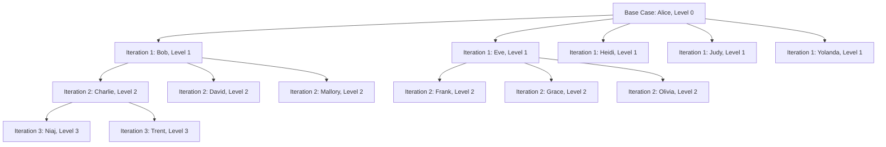

# Module 7: Advanced SQL Mastery

## Introduction

Welcome to Module 7 of the Database Management Systems course. In this module, we explore the most advanced and powerful features of modern SQL dialects, with a specific focus on PostgreSQL. These features allow you to write complex analytical queries, traverse hierarchical data, handle semi-structured data natively, and perform advanced data modifications in a single statement. 

By the end of this module, you will be able to perform calculations across sets of rows related to the current row, write recursive queries to process graphs, use advanced aggregation techniques for multidimensional analysis, manipulate JSON documents inside the database, and execute complex DML operations securely and efficiently.

---

## Data Setup for Examples

To ensure all examples in this document can be executed in your PostgreSQL environment, we provide the complete schema and data setup below. We will use a standard e-commerce and HR schema for our examples.

```sql
DROP TABLE IF EXISTS sales;
DROP TABLE IF EXISTS employees;
DROP TABLE IF EXISTS documents;
DROP TABLE IF EXISTS daily_sales_summary;
DROP TABLE IF EXISTS target_table;
DROP TABLE IF EXISTS source_table;

CREATE TABLE employees (
    emp_id SERIAL PRIMARY KEY,
    name VARCHAR(100) NOT NULL,
    department VARCHAR(50) NOT NULL,
    salary NUMERIC(10, 2) NOT NULL,
    hire_date DATE NOT NULL,
    manager_id INTEGER REFERENCES employees(emp_id)
);

-- Insert hierarchical data
INSERT INTO employees (name, department, salary, hire_date, manager_id) VALUES
('Alice', 'Executive', 250000.00, '2015-01-01', NULL),
('Bob', 'Engineering', 150000.00, '2016-03-15', 1),
('Charlie', 'Engineering', 120000.00, '2017-06-20', 2),
('David', 'Engineering', 110000.00, '2018-01-10', 2),
('Eve', 'Sales', 130000.00, '2016-08-01', 1),
('Frank', 'Sales', 95000.00, '2019-02-15', 5),
('Grace', 'Sales', 90000.00, '2020-04-01', 5),
('Heidi', 'HR', 100000.00, '2017-10-15', 1),
('Ivan', 'HR', 80000.00, '2018-11-20', 8),
('Judy', 'Marketing', 115000.00, '2016-05-10', 1),
('Mallory', 'Engineering', 125000.00, '2019-09-01', 2),
('Niaj', 'Engineering', 105000.00, '2020-01-15', 3),
('Olivia', 'Sales', 92000.00, '2021-03-10', 5),
('Peggy', 'HR', 85000.00, '2021-07-22', 8),
('Sybil', 'Marketing', 95000.00, '2018-12-05', 10),
('Trent', 'Engineering', 90000.00, '2022-01-10', 3),
('Victor', 'Sales', 85000.00, '2022-03-15', 6),
('Walter', 'HR', 75000.00, '2022-05-20', 9),
('Xena', 'Marketing', 90000.00, '2022-08-10', 10),
('Yolanda', 'Executive', 200000.00, '2015-06-01', 1);

CREATE TABLE sales (
    sale_id SERIAL PRIMARY KEY,
    emp_id INTEGER REFERENCES employees(emp_id),
    sale_date DATE NOT NULL,
    amount NUMERIC(10, 2) NOT NULL,
    region VARCHAR(50) NOT NULL
);

-- Insert temporal sales data
INSERT INTO sales (emp_id, sale_date, amount, region) VALUES
(5, '2023-01-15', 15000.00, 'North'),
(5, '2023-02-20', 20000.00, 'North'),
(6, '2023-01-10', 10000.00, 'South'),
(6, '2023-03-05', 12000.00, 'South'),
(7, '2023-02-15', 18000.00, 'East'),
(7, '2023-04-10', 22000.00, 'East'),
(13, '2023-03-20', 11000.00, 'West'),
(13, '2023-05-15', 16000.00, 'West'),
(5, '2023-06-10', 25000.00, 'North'),
(6, '2023-07-20', 14000.00, 'South'),
(7, '2023-08-15', 19000.00, 'East'),
(13, '2023-09-10', 21000.00, 'West'),
(5, '2023-10-05', 17000.00, 'North'),
(6, '2023-11-20', 13000.00, 'South'),
(7, '2023-12-15', 24000.00, 'East'),
(13, '2023-12-30', 28000.00, 'West');

CREATE TABLE documents (
    doc_id SERIAL PRIMARY KEY,
    attributes JSONB NOT NULL
);

-- Insert JSONB semi-structured data
INSERT INTO documents (attributes) VALUES
('{"title": "Q1 Report", "tags": ["finance", "q1"], "author": {"name": "Alice", "id": 1}, "views": 150}'),
('{"title": "Architecture V2", "tags": ["engineering", "design"], "author": {"name": "Bob", "id": 2}, "views": 320}'),
('{"title": "Marketing Campaign", "tags": ["marketing", "social"], "author": {"name": "Judy", "id": 10}, "views": 45}'),
('{"title": "Employee Handbook", "tags": ["hr", "onboarding"], "author": {"name": "Heidi", "id": 8}, "views": 890}'),
('{"title": "Q2 Projections", "tags": ["finance", "q2"], "author": {"name": "Alice", "id": 1}, "views": 210}'),
('{"title": "API Documentation", "tags": ["engineering", "api"], "author": {"name": "Charlie", "id": 3}, "views": 1500}');
```

---

## 1. Window Functions

Window functions provide the ability to perform calculations across a set of rows that are somehow related to the current row. This is comparable to the type of calculation that can be done with an aggregate function. However, unlike regular aggregate functions, use of a window function does not cause rows to become grouped into a single output row; the rows retain their separate identities.

### Anatomy of a Window Function

A window function call always contains an `OVER` clause directly following the window function's name and arguments. This is what syntactically distinguishes it from a regular function or non-window aggregate.

```sql
function_name (expression) OVER (
    [PARTITION BY partition_expression, ... ]
    [ORDER BY sort_expression [ASC | DESC], ... ]
    [frame_clause]
)
```

- **PARTITION BY**: Divides the result set into partitions to which the window function is applied. If omitted, the whole result set is treated as a single partition.
- **ORDER BY**: Defines the logical order of the rows within each partition.
- **Frame Clause**: Defines the subset of rows within the partition that are evaluated for the current row.

### The Frame Clause Explained

The frame clause specifies the set of rows constituting the window frame, which is a subset of the current partition. 

The syntax for the frame clause is:
`{ RANGE | ROWS | GROUPS } frame_start [ frame_exclusion ]`
or
`{ RANGE | ROWS | GROUPS } BETWEEN frame_start AND frame_end [ frame_exclusion ]`

Where `frame_start` and `frame_end` can be:
- `UNBOUNDED PRECEDING`: The frame starts at the first row of the partition.
- `offset PRECEDING`: The frame starts `offset` rows before the current row (only valid for `ROWS` and `GROUPS`).
- `CURRENT ROW`: For `ROWS`, the current row. For `RANGE` and `GROUPS`, all peers of the current row.
- `offset FOLLOWING`: The frame ends `offset` rows after the current row.
- `UNBOUNDED FOLLOWING`: The frame ends at the last row of the partition.

**ROWS vs RANGE vs GROUPS**:
- `ROWS`: Considers exactly the specified number of rows before or after the current row based on physical position.
- `RANGE`: Considers all rows that have the same `ORDER BY` values as the current row (peers), plus those within the specified range of values (requires a numeric or datetime `ORDER BY` column).
- `GROUPS`: Considers all rows that are in the specified number of peer groups before or after the current peer group.

If `ORDER BY` is specified but no frame clause is given, the default frame is `RANGE BETWEEN UNBOUNDED PRECEDING AND CURRENT ROW`.
If no `ORDER BY` is specified, the default frame is `ROWS BETWEEN UNBOUNDED PRECEDING AND UNBOUNDED FOLLOWING`.

### Detailed Examples of Window Functions

#### 1. Ranking Functions

Ranking functions assign a rank to each row within a partition based on the `ORDER BY` clause.

```sql
SELECT 
    name, 
    department, 
    salary,
    ROW_NUMBER() OVER (PARTITION BY department ORDER BY salary DESC) as row_num,
    RANK() OVER (PARTITION BY department ORDER BY salary DESC) as rank,
    DENSE_RANK() OVER (PARTITION BY department ORDER BY salary DESC) as dense_rank
FROM employees;
```

*Explanation*: 
- `ROW_NUMBER` assigns a unique, sequential integer to each row within the partition, starting at 1. Ties are broken arbitrarily if not specified by further `ORDER BY` columns.
- `RANK` assigns the same rank to ties and skips subsequent ranks (e.g., if two people have rank 1, the next person has rank 3).
- `DENSE_RANK` assigns the same rank to ties but does not skip ranks (e.g., if two people have rank 1, the next person has rank 2).

#### 2. Running Totals (Cumulative Sum)

To calculate a running total, we use the `SUM` aggregate function as a window function with an `ORDER BY` clause. By default, `ORDER BY` implies a frame of `RANGE BETWEEN UNBOUNDED PRECEDING AND CURRENT ROW`.

```sql
SELECT 
    sale_date,
    amount,
    SUM(amount) OVER (ORDER BY sale_date) as default_running_total,
    SUM(amount) OVER (ORDER BY sale_date ROWS BETWEEN UNBOUNDED PRECEDING AND CURRENT ROW) as strict_running_total
FROM sales
WHERE emp_id = 5;
```

*Important Note on RANGE vs ROWS*: If there are two sales on the exact same `sale_date` (ties), the default `RANGE` behavior will sum them together and assign the same running total to both rows (representing the total at the *end* of that day). If you use `ROWS`, it will increment the running total row-by-row regardless of ties in `sale_date`.

#### 3. Moving Averages

You can use the frame clause to calculate a moving average over a specific window of time.

```sql
-- 3-row moving average (current row and the 2 preceding rows)
SELECT 
    sale_date,
    amount,
    AVG(amount) OVER (
        ORDER BY sale_date 
        ROWS BETWEEN 2 PRECEDING AND CURRENT ROW
    ) as moving_avg_3_rows
FROM sales
WHERE emp_id = 5;
```

#### 4. Lead and Lag (Accessing Adjacent Rows)

`LAG` allows you to access data from a previous row in the same result set without using a self-join. `LEAD` accesses data from a subsequent row.

```sql
SELECT 
    name,
    hire_date,
    LAG(hire_date, 1) OVER (ORDER BY hire_date) as previous_hire,
    LEAD(hire_date, 1) OVER (ORDER BY hire_date) as next_hire,
    hire_date - LAG(hire_date, 1) OVER (ORDER BY hire_date) as days_since_last_hire
FROM employees;
```

#### 5. First Value, Last Value, Nth Value

These functions return a value evaluated at a specific row within the window frame.

```sql
SELECT 
    department,
    name,
    salary,
    FIRST_VALUE(name) OVER (
        PARTITION BY department 
        ORDER BY salary DESC
        ROWS BETWEEN UNBOUNDED PRECEDING AND UNBOUNDED FOLLOWING
    ) as highest_paid_in_dept,
    NTH_VALUE(name, 2) OVER (
        PARTITION BY department 
        ORDER BY salary DESC
        ROWS BETWEEN UNBOUNDED PRECEDING AND UNBOUNDED FOLLOWING
    ) as second_highest_paid_in_dept
FROM employees;
```

#### 6. Percentile Calculation (Ordered-Set Aggregates)

To calculate percentiles (e.g., the median, which is the 50th percentile), SQL provides ordered-set aggregate functions using the `WITHIN GROUP` clause. These are not strictly window functions (as they collapse rows), but they are often taught alongside them for analytical purposes. You can also use them as window functions by adding an `OVER()` clause.

```sql
SELECT 
    department,
    PERCENTILE_CONT(0.5) WITHIN GROUP (ORDER BY salary) as median_salary,
    PERCENTILE_CONT(0.9) WITHIN GROUP (ORDER BY salary) as p90_salary
FROM employees
GROUP BY department;
```

*Mathematical Note*: 
- `PERCENTILE_CONT` interpolates continuously between adjacent values. If the median falls between two rows, it calculates the average of those two rows. 
- Let $N$ be the number of rows in the group, and $P$ the percentile (from 0 to 1). The row index (1-based) is $I = 1 + (N - 1) \times P$. If $I$ is not an integer, the function interpolates between the value at $\lfloor I \rfloor$ and $\lceil I \rceil$.
- `PERCENTILE_DISC` returns the exact discrete value from the dataset that corresponds to the nearest percentile.

---

## 2. Recursive CTEs

Common Table Expressions (CTEs) can be recursive. A recursive CTE is a CTE that references itself. They are incredibly useful for traversing hierarchical or graph data, such as organizational charts, file systems, or bill of materials.

### Syntax of a Recursive CTE

```sql
WITH RECURSIVE cte_name AS (
    -- Non-recursive term (Base Case)
    SELECT ...
    UNION [ALL]
    -- Recursive term (Inductive Step)
    SELECT ... FROM cte_name WHERE ...
)
SELECT * FROM cte_name;
```

### Execution Semantics

1. Evaluate the non-recursive term (the base case). Place the results into a temporary working table and into the final result table.
2. Evaluate the recursive term (the inductive step), assuming the temporary working table contains the rows returned by the previous iteration. 
3. Append the results to the final result table and replace the working table with these newly generated results.
4. Repeat steps 2 and 3 until the working table is empty (i.e., the recursive term returns no rows).

### Example: Organizational Chart (Employee Hierarchy)

We want to find all subordinates of 'Alice' (who has `emp_id` = 1), including subordinates of subordinates, and determine their depth in the hierarchy.

```sql
WITH RECURSIVE org_chart AS (
    -- Base case: Top-level manager (Alice)
    SELECT 
        emp_id, 
        name, 
        manager_id, 
        0 AS level,
        CAST(name AS VARCHAR(1000)) AS path
    FROM employees
    WHERE name = 'Alice'
    
    UNION ALL
    
    -- Recursive step: Join employees to the working table (org_chart)
    SELECT 
        e.emp_id, 
        e.name, 
        e.manager_id, 
        oc.level + 1,
        CAST(oc.path || ' -> ' || e.name AS VARCHAR(1000))
    FROM employees e
    INNER JOIN org_chart oc ON e.manager_id = oc.emp_id
)
SELECT * FROM org_chart ORDER BY level, name;
```

### Diagram of the Execution



### Avoiding Infinite Loops (Cycle Detection)

If dealing with graphs that might contain cycles (e.g., node A points to node B, and node B points to node A), recursive CTEs can loop infinitely. PostgreSQL 14+ introduced a standard SQL `CYCLE` clause to handle this natively. For older versions, you manage an array of visited nodes manually.

```sql
-- Using an array to prevent cycles natively (PostgreSQL < 14 pattern)
WITH RECURSIVE graph_traversal AS (
    -- Assuming a theoretical `nodes` table with `id` and `next_id`
    SELECT id, next_id, ARRAY[id] as visited_path
    FROM nodes
    WHERE id = 1
    
    UNION ALL
    
    SELECT n.id, n.next_id, gt.visited_path || n.id
    FROM nodes n
    JOIN graph_traversal gt ON n.id = gt.next_id
    WHERE n.id != ALL(gt.visited_path) -- Stop condition if cycle detected
)
SELECT * FROM graph_traversal;
```

---

## 3. Advanced Aggregations

PostgreSQL offers advanced grouping features that allow you to compute multiple levels of aggregation in a single query, significantly improving performance and readability over writing multiple `UNION ALL` statements.

### 1. The FILTER Clause

The `FILTER` clause is an extension to aggregate functions that allows you to specify a condition for which rows are included in the aggregate. This makes generating pivot tables and selective aggregations much cleaner and faster than using `CASE WHEN` statements.

```sql
SELECT 
    department,
    COUNT(*) AS total_employees,
    COUNT(*) FILTER (WHERE salary > 100000) AS high_earners,
    SUM(salary) FILTER (WHERE hire_date > '2019-01-01') AS new_hire_payroll,
    AVG(salary) FILTER (WHERE manager_id IS NOT NULL) AS avg_non_exec_salary
FROM employees
GROUP BY department;
```

*Execution Plan Benefit*: The database engine can compute these filtered aggregates in a single pass over the table data, whereas multiple subqueries would require multiple passes.

### 2. GROUPING SETS

`GROUPING SETS` allow you to group by multiple sets of columns in a single query. The result is the union of the grouping sets specified.

```sql
SELECT 
    department, 
    manager_id, 
    SUM(salary) as total_salary
FROM employees
GROUP BY GROUPING SETS (
    (department, manager_id), -- Subtotals by department and manager
    (department),             -- Subtotals by department only
    ()                        -- Grand Total
)
ORDER BY department, manager_id;
```

### 3. ROLLUP

`ROLLUP` is a shorthand for generating grouping sets that represent a hierarchy. `ROLLUP(a, b, c)` generates grouping sets: `(a, b, c)`, `(a, b)`, `(a)`, and `()`. This is incredibly useful for generating reports with drill-down totals.

```sql
SELECT 
    EXTRACT(YEAR FROM sale_date) as sale_year,
    EXTRACT(MONTH FROM sale_date) as sale_month,
    region,
    SUM(amount) as total_sales
FROM sales
GROUP BY ROLLUP (EXTRACT(YEAR FROM sale_date), EXTRACT(MONTH FROM sale_date), region)
ORDER BY sale_year, sale_month, region;
```

### 4. CUBE

`CUBE` generates all possible combinations of grouping sets for the given columns. `CUBE(a, b)` generates `(a, b)`, `(a)`, `(b)`, and `()`. This is useful for cross-tabulation reports.

```sql
SELECT 
    department,
    EXTRACT(YEAR FROM hire_date) as hire_year,
    COUNT(*) as num_hired,
    SUM(salary) as total_salary
FROM employees
GROUP BY CUBE (department, EXTRACT(YEAR FROM hire_date))
ORDER BY department, hire_year;
```

### The GROUPING Function

When using `ROLLUP` or `CUBE`, NULL values are returned for the columns that are not part of the current grouping set. The `GROUPING` function helps distinguish between a true NULL value in the data and a NULL representing the grand total or subtotal.

```sql
SELECT 
    department,
    manager_id,
    SUM(salary) as total_salary,
    GROUPING(department) as is_dept_total,
    GROUPING(manager_id) as is_manager_total
FROM employees
GROUP BY ROLLUP(department, manager_id);
```
*Output logic*: `GROUPING(col)` returns 1 if the column is NOT part of the current grouping set (meaning the NULL is a subtotal indicator), and 0 if the column IS part of the grouping set (meaning any NULL is a genuine NULL value in the source data).

---

## 4. JSON and JSONB in PostgreSQL

PostgreSQL provides unparalleled support for JSON data, allowing for hybrid relational and document-oriented schemas. You get the strict consistency of a relational database alongside the flexibility of a document store like MongoDB.

### JSON vs JSONB

- **JSON**: Stores an exact copy of the input text, requiring reparsing on each execution. Preserves whitespace, order of keys, and duplicate keys.
- **JSONB**: Stores data in a decomposed binary format. Slightly slower to ingest due to conversion overhead, but significantly faster to process, as it does not require reparsing. Does not preserve whitespace, order of keys, or duplicate keys. Crucially, JSONB supports indexing (GIN and GiST). **Always prefer `JSONB` for general use unless you explicitly need to preserve formatting.**

### JSONB Operators and Functions

#### 1. Extracting Data

- `->` : Returns JSON array element or object field as JSONB.
- `->>` : Returns JSON array element or object field as text.
- `#>` : Extracts JSON sub-object at the specified path (represented as a text array) as JSONB.
- `#>>` : Extracts JSON sub-object at the specified path as text.

```sql
-- Get the title as text
SELECT attributes->>'title' AS title FROM documents;

-- Get the author's name (nested field)
SELECT attributes->'author'->>'name' AS author_name FROM documents;

-- Using path extraction for deep nesting
SELECT attributes#>>'{author, name}' AS author_name FROM documents;

-- Get an element from a JSON array by index (0-based)
SELECT attributes->'tags'->>0 AS primary_tag FROM documents;
```

#### 2. Filtering and Containment

The `@>` operator checks if the left JSONB value contains the right JSONB value at the top level. This is the most common operator used with GIN indexes.

```sql
-- Find documents tagged with 'finance' (array containment)
SELECT doc_id, attributes->>'title' as title 
FROM documents
WHERE attributes @> '{"tags": ["finance"]}';

-- Find documents authored by Alice (object containment)
SELECT doc_id, attributes->>'title' as title 
FROM documents
WHERE attributes @> '{"author": {"name": "Alice"}}';
```

#### 3. Existence Operators

These operators check for the existence of keys at the top level.
- `?` : Does the key/element string exist within the JSONB value?
- `?|` : Do any of these key/element strings exist?
- `?&` : Do all of these key/element strings exist?

```sql
-- Find documents that have a 'views' key
SELECT doc_id FROM documents
WHERE attributes ? 'views';

-- Find documents that have either 'tags' or 'categories'
SELECT doc_id FROM documents
WHERE attributes ?| array['tags', 'categories'];
```

#### 4. Updating JSONB

Use `jsonb_set` to update a specific path. It takes four arguments: target jsonb, path array, new value jsonb, and a boolean indicating whether to create the key if missing.

```sql
-- Update the views count
UPDATE documents
SET attributes = jsonb_set(
    attributes, 
    '{views}', 
    '500'::jsonb, 
    true
)
WHERE doc_id = 1;

-- Delete a key using the minus operator
UPDATE documents
SET attributes = attributes - 'views'
WHERE doc_id = 2;
```

### Indexing JSONB

To make queries using `@>`, `?`, `?|`, and `?&` extremely fast, use a GIN (Generalized Inverted Index) index. A GIN index creates an inverted index mapping every key and value in the JSONB document to the row containing it.

```sql
CREATE INDEX idx_docs_attributes ON documents USING GIN (attributes);

-- A more specialized index on a specific extracted field (B-tree index)
CREATE INDEX idx_docs_author_name ON documents ((attributes->'author'->>'name'));
```

---

## 5. CTEs and Advanced Patterns

This section covers how to modify data efficiently and securely using advanced SQL patterns.

### 1. Data Modification in CTEs

You can use `INSERT`, `UPDATE`, and `DELETE` within CTEs. Paired with the `RETURNING` clause, this allows you to move rows between tables or chain modifications in a single atomic query, without needing PL/pgSQL stored procedures.

```sql
-- Create an archive table with identical structure
CREATE TABLE employees_archive (LIKE employees);

-- Move an employee from active to archive in one query
WITH deleted_emp AS (
    DELETE FROM employees
    WHERE emp_id = 15
    RETURNING *
)
INSERT INTO employees_archive
SELECT * FROM deleted_emp;
```
*Why this is powerful*: This operation happens entirely on the database server in a single transaction. The application tier never needs to pull the data down to push it back up.

### 2. UPSERT (INSERT ON CONFLICT)

The `INSERT ... ON CONFLICT` statement provides native "upsert" functionality. It attempts an insert, and if a unique constraint violation occurs, it switches to an update (or does nothing).

```sql
-- Assume we have a daily summary table
CREATE TABLE daily_sales_summary (
    sale_date DATE PRIMARY KEY,
    total_amount NUMERIC(10, 2)
);

-- Initial insert
INSERT INTO daily_sales_summary (sale_date, total_amount)
VALUES ('2023-01-15', 15000.00);

-- Upsert: Insert if not exists, otherwise add to existing total
INSERT INTO daily_sales_summary (sale_date, total_amount)
VALUES ('2023-01-15', 5000.00)
ON CONFLICT (sale_date) 
DO UPDATE SET total_amount = daily_sales_summary.total_amount + EXCLUDED.total_amount;
```
*Note*: The `EXCLUDED` special table represents the row proposed for insertion. `daily_sales_summary.total_amount` is the existing value in the table.

You can also use `DO NOTHING` to simply skip duplicates without error:
```sql
INSERT INTO daily_sales_summary (sale_date, total_amount)
VALUES ('2023-01-15', 5000.00)
ON CONFLICT (sale_date) DO NOTHING;
```

### 3. The MERGE Statement

Introduced in PostgreSQL 15, `MERGE` provides a standard SQL way to perform conditional insert, update, and delete operations based on a join condition. It is more flexible than `ON CONFLICT` because it handles complex merging logic between a target table and a source query.

```sql
-- Setup Target
CREATE TABLE target_table (id INT PRIMARY KEY, name VARCHAR, status VARCHAR);
INSERT INTO target_table VALUES (1, 'Alice', 'ACTIVE'), (2, 'Bob', 'ACTIVE');

-- Setup Source
CREATE TABLE source_table (id INT PRIMARY KEY, name VARCHAR, status VARCHAR);
INSERT INTO source_table VALUES (1, 'Alice Modified', 'ACTIVE'), (2, 'Bob', 'DELETED'), (3, 'Charlie', 'ACTIVE');

-- MERGE operation
MERGE INTO target_table t
USING source_table s
ON t.id = s.id
WHEN MATCHED AND s.status = 'DELETED' THEN
    DELETE
WHEN MATCHED THEN
    UPDATE SET name = s.name
WHEN NOT MATCHED THEN
    INSERT (id, name, status) VALUES (s.id, s.name, s.status);
```
After execution:
- Row 1 (Alice) is updated.
- Row 2 (Bob) is deleted because status is 'DELETED'.
- Row 3 (Charlie) is inserted.

### 4. Generating Series (Bonus Trick)

`generate_series` is a set-returning function heavily used for generating date sequences or numeric ranges, crucial for filling in missing dates in reports.

```sql
-- Generate all dates in January 2023
SELECT day::DATE 
FROM generate_series(
    '2023-01-01'::DATE, 
    '2023-01-31'::DATE, 
    '1 day'::INTERVAL
) AS day;
```

By joining this generated sequence to your data (using a `LEFT JOIN`), you ensure that reports display a zero for days with no activity, rather than missing the day entirely. This is a very common requirement in BI reporting.

```sql
-- Report showing sales for every day in January, filling gaps with zero
WITH date_series AS (
    SELECT day::DATE as d
    FROM generate_series('2023-01-01'::DATE, '2023-01-31'::DATE, '1 day'::INTERVAL) AS day
)
SELECT 
    ds.d as sale_date,
    COALESCE(SUM(s.amount), 0) as daily_total
FROM date_series ds
LEFT JOIN sales s ON ds.d = s.sale_date
GROUP BY ds.d
ORDER BY ds.d;
```

---
## Conclusion
This module thoroughly covered advanced aggregation, data modification, and querying patterns in PostgreSQL. Mastering these features—specifically Window Functions, Recursive CTEs, JSONB manipulation, and Upserts—will transition you from a competent SQL user to an advanced database engineer capable of solving highly complex data tasks entirely within the relational database engine, often thousands of times faster than processing the data in application code.
