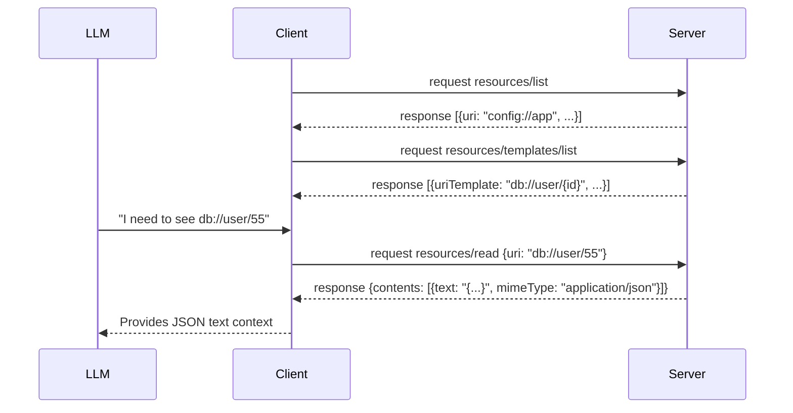

# Module 4: Resources Cheatsheet

## Resource vs. Tool
| Feature | Resource | Tool |
| :--- | :--- | :--- |
| **Purpose** | Expose read-only data / context | Execute actions / side effects |
| **Identifier** | URI (`file:///...`, `db://...`) | Name (`query_db`, `write_file`) |
| **Inputs** | None (just the URI) | JSON Schema arguments |
| **Outputs** | Text or Base64 Blob | JSON or Text |
| **Idempotent** | Yes (Safe to read repeatedly) | No (May mutate state) |

## Core Methods
*   `resources/list`: Get all static resources.
*   `resources/templates/list`: Get all dynamic URI templates.
*   `resources/read`: Fetch content for a specific URI.
*   `resources/subscribe`: Request notifications for a URI.
*   `notifications/resources/updated`: Server tells client a resource changed.

## URI Template Syntax (RFC 6570)
*   Format: `scheme://authority/path/{variable}`
*   Example: `postgres://analytics-db/users/{user_id}`
*   *Note: Client substitutes `{user_id}` before calling `resources/read`.*

## MIME Type Guide
Always provide an accurate `mimeType` in list and read responses.
*   **Text/Code**: `text/plain`, `text/markdown`, `text/csv`, `text/html`
*   **Data**: `application/json`, `application/xml`
*   **Binary (Blob)**: `image/png`, `image/jpeg`, `application/pdf`

## Read Flow Diagram


## Python SDK Quick Ref
```python
@app.list_resources()
async def list_res(): return [Resource(uri="file://foo.txt", name="Foo")]

@app.list_resource_templates()
async def list_tpl(): return [ResourceTemplate(uriTemplate="db://{id}", name="DB")]

@app.read_resource()
async def read_res(uri: str):
    if uri == "file://foo.txt":
        return [TextResourceContents(uri=uri, mimeType="text/plain", text="hello")]
    return [BlobResourceContents(uri=uri, mimeType="image/png", blob="base64...")]
```
