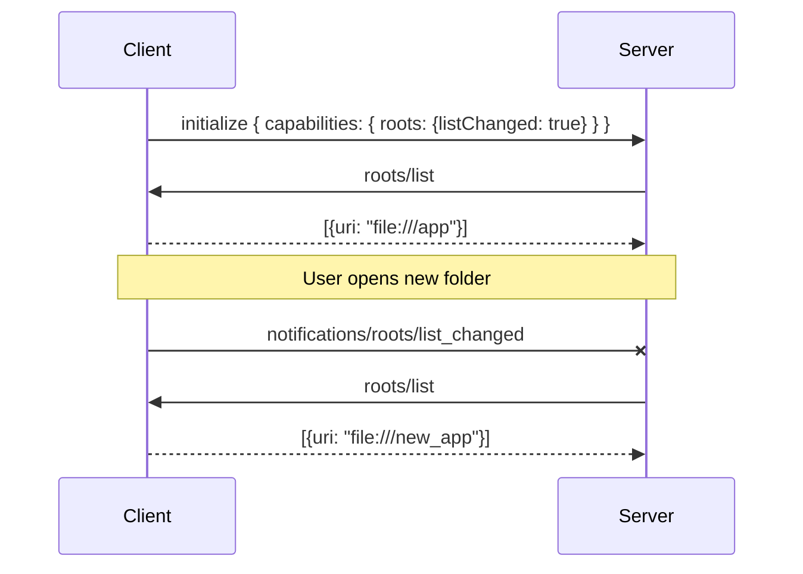

# Module 6: Sampling & Roots Cheatsheet

## Sampling Quick Ref
**Direction:** Server ➔ Client (Server asks Client to run LLM)
**Purpose:** Offload AI reasoning to the client's LLM to save keys/costs.
**Method:** `sampling/createMessage`

**Request Schema:**
```json
{
  "messages": [{ "role": "user", "content": { "type": "text", "text": "..." } }],
  "systemPrompt": "You are a summarizing agent.",
  "maxTokens": 150,
  "modelPreferences": {
    "costPriority": 0.2,       // 0-1 scale
    "speedPriority": 0.8,
    "intelligencePriority": 0.5
  }
}
```

## Roots Quick Ref
**Direction:** Client ➔ Server (Client tells Server where it can operate)
**Purpose:** Security boundaries (e.g., restricting file access to a specific folder).
**Method:** `roots/list`

**Response Structure:**
```json
{
  "roots": [
    {
      "uri": "file:///path/to/workspace",
      "name": "Project Folder"
    }
  ]
}
```

## Capability Flags Reference
Checked during the `initialize` handshake.

**Client Capabilities (What the client supports):**
*   `sampling: {}`: Client can process `sampling/createMessage`.
*   `roots: { listChanged: true }`: Client provides boundaries and notifies on changes.

**Server Capabilities (What the server supports):**
*   *Note: Server does not advertise roots/sampling capabilities, it consumes them.*

## Roots Flow Diagram


## Security Best Practices
1.  **Strict Path Checking**: Always use `os.path.abspath` and `str.startswith` to ensure a requested file path falls strictly within an approved Root URI.
2.  **Graceful Degradation**: Always check client capabilities. If `sampling` isn't present, disable agentic tools gracefully.
