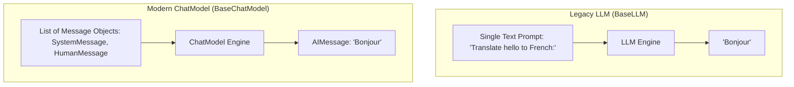

# Module 1: Setup & Basics

This module introduces you to the core components of LangChain, explains the landscape of modern LLM interfaces, and walks through setting up free API connections.

---

## 💡 Core Theory

### 1. What is LangChain?
LangChain is a framework for developing applications powered by large language models. It provides a standard interface, modular components, and ready-to-use integrations to assemble chains and agents. 

To keep the library light and modular, the LangChain team split the project into distinct packages:
- **`langchain-core`**: The foundational package containing base interfaces and core schemas (prompts, models, document loaders, vector stores, memory). It has zero heavy dependencies.
- **`langchain-community`**: Community-maintained integrations containing third-party wrappers (like vector store engines, specific document parsers, databases).
- **Partner Packages** (e.g., `langchain-openai`, `langchain-huggingface`): Specialized, officially maintained packages for major providers to ensure peak performance and stability.
- **`langchain`**: The orchestrator package containing generic chain logic, cognitive architectures, and agent templates.

---

### 2. LLMs vs. ChatModels
In LangChain, there is a fundamental distinction between text completion models (LLMs) and message-based chat models (ChatModels):



#### Legacy LLMs (`BaseLLM`)
- **Inputs**: A single string (raw prompt text).
- **Outputs**: A single string (completion text).
- **Use Case**: Older base models (e.g., GPT-3 `text-davinci-003`, Llama-2 raw base models).
- **LangChain Class**: `from langchain_core.language_models.llms import LLM`

#### Modern ChatModels (`BaseChatModel`)
- **Inputs**: A list of structured message objects representing a conversation transcript.
- **Outputs**: A structured chat message object (typically an `AIMessage`).
- **Use Case**: Instruction-tuned or chat-tuned models (e.g., GPT-4o, Claude 3.5, Llama 3 Chat, Gemma 2 IT).
- **LangChain Class**: `from langchain_core.language_models.chat_models import BaseChatModel`

---

### 3. Understanding Message Types
ChatModels process and return messages. In LangChain, these are represented by objects in `langchain_core.messages`:

| Message Class | Purpose | Description |
| :--- | :--- | :--- |
| **`SystemMessage`** | Instruction | Sets the behavior, tone, rules, or identity of the AI model. Usually placed at the very beginning of the message list. |
| **`HumanMessage`** | User Input | Represents the text, query, or prompt sent by the human user. |
| **`AIMessage`** | Assistant Response | Represents the reply returned by the AI model. Contains metadata like token usage, model name, and tool call requests. |
| **`ChatMessage`** | Custom Role | Represents a message with an arbitrary role parameter (e.g., `"function"`, `"user_role"`). Rarely used directly. |

---

## 🔌 Connecting to Free Model APIs

Since we are focusing on **free, accessible APIs**, we will construct our wrappers using OpenRouter and Hugging Face.

### A. OpenRouter Setup
OpenRouter routes your API calls to dozens of open-source models, offering many of them (like Gemma 2 9B, Llama 3 8B, Qwen 2.5) for free. Because OpenRouter mimics the OpenAI API format, we use `ChatOpenAI` from the `langchain-openai` package.

```python
from langchain_openai import ChatOpenAI

# OpenRouter is OpenAI-compatible:
model = ChatOpenAI(
    openai_api_base="https://openrouter.ai/api/v1",
    openai_api_key="your_openrouter_key",
    model_name="google/gemma-2-9b-it:free", # Free tier model
    temperature=0.7,
)
```

### B. Hugging Face Inference API
You can run serverless inference on open models hosted on the Hugging Face Hub using the `langchain-huggingface` package:

```python
from langchain_huggingface import HuggingFaceEndpoint, ChatHuggingFace

# 1. Instantiate the HuggingFaceEndpoint (represents the text completion back-end)
llm = HuggingFaceEndpoint(
    repo_id="meta-llama/Meta-Llama-3-8B-Instruct",
    huggingfacehub_api_token="your_hf_token",
    task="text-generation",
    temperature=0.7,
)

# 2. Wrap it with ChatHuggingFace to handle list-of-messages format correctly
model = ChatHuggingFace(llm=llm)
```

---

## 🔍 Behind the Scenes: The Response Payload
When a model responds, LangChain wraps the result in an `AIMessage` object. Let's look at the structure of this payload to see what information is returned:

```python
response = model.invoke([HumanMessage(content="Explain tokens in one sentence.")])
```

The output `response` is an instance of `AIMessage` containing:
* **`content`**: The actual text generated by the model (e.g., `"Tokens are the basic building blocks of text processed by language models, representing characters, sub-words, or words."`).
* **`response_metadata`**: A dictionary containing provider-specific values:
  * `token_usage`: Counts of `prompt_tokens`, `completion_tokens`, and `total_tokens`.
  * `finish_reason`: Why the model stopped generating (e.g., `"stop"`, `"length"`).
  * `model_name`: The actual model that executed the generation.
* **`id`**: A unique message identifier generated by LangChain.
