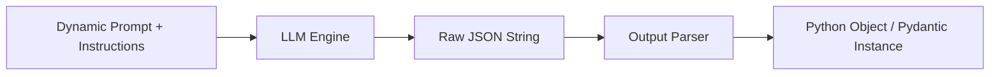

# Module 2: Prompts & Output Parsers

In this module, we move beyond raw strings to look at how we format prompts dynamically and extract structured, validated data from LLMs.

---

## 💡 Core Theory

### 1. What are Prompt Templates?
While Python f-strings can format simple variables, LangChain's **`PromptTemplate`** system offers key advantages:
* **Message Sequencing**: Seamlessly formats lists of messages containing complex role definitions (`System`, `Human`, `AI`).
* **Composition**: Allows merging and nesting templates together.
* **Validation**: Automatically checks that all required parameters are passed, preventing runtime prompt corruption.
* **Portability**: Templates can be saved to, and loaded from, configuration files (YAML/JSON).

There are two primary template interfaces:

#### A. `PromptTemplate` (Text Completions)
Used for single-string prompt engineering.
```python
from langchain_core.prompts import PromptTemplate

template = PromptTemplate.from_template("Tell me a {adjective} joke about {topic}.")
formatted = template.format(adjective="corny", topic="programming")
# Output: "Tell me a corny joke about programming."
```

#### B. `ChatPromptTemplate` (Chat Conversations)
Used to construct lists of messages dynamically.
```python
from langchain_core.prompts import ChatPromptTemplate

chat_template = ChatPromptTemplate.from_messages([
    ("system", "You are a helpful translator that translates {input_lang} to {output_lang}."),
    ("human", "Translate this sentence: {text}"),
])

formatted_messages = chat_template.format_messages(
    input_lang="English",
    output_lang="German",
    text="I love building workflows with LangChain."
)
```

---

### 2. Output Parsers
By default, language models return raw strings. To build reliable software pipelines, we need the model's output in a structured format (like JSON, a Python list, or a validated database record). 



LangChain provides several output parsers in `langchain_core.output_parsers`:
* **`StrOutputParser`**: The simplest parser. Extracts the text content from the output `AIMessage` and discards metadata.
* **`CommaSeparatedListOutputParser`**: Parses comma-delimited strings into Python lists (`['apple', 'banana', 'orange']`).
* **`JsonOutputParser`**: Instructs the model to output valid JSON and parses it into a native Python dictionary.
* **`PydanticOutputParser`**: The most powerful and robust parser. It takes a custom Pydantic data schema, creates structured formatting instructions, and validates the model's output against the schema, converting the output into an instance of your Pydantic class.

---

## 🛠️ Deep Dive: How Pydantic Parsing Works Under the Hood

The process of parsing using `PydanticOutputParser` involves three steps:

### Step 1: Define the Schema
Define your target data structure using Pydantic:
```python
from pydantic import BaseModel, Field

class CountryInfo(BaseModel):
    name: str = Field(description="The name of the country")
    capital: str = Field(description="The capital city of the country")
    languages: list[str] = Field(description="List of official languages spoken")
```

### Step 2: Inject Formatting Instructions
The parser can generate specific instructions that dictate how the LLM must format its reply to comply with the Pydantic schema. We inject these instructions directly into our Prompt Template:

```python
from langchain_core.output_parsers import PydanticOutputParser
from langchain_core.prompts import ChatPromptTemplate

# Initialize the parser
parser = PydanticOutputParser(pydantic_object=CountryInfo)

# Fetch the format instructions generated by the parser
format_instructions = parser.get_format_instructions()

# Build the prompt template including format instructions as a variable
prompt = ChatPromptTemplate.from_messages([
    ("system", "You return country details in the exact format required.\n{format_instructions}"),
    ("human", "Provide details for the country: {country}")
])
```

### Step 3: Parse the Output
Once the model responds, we pass the raw text to the parser's `parse()` method:

```python
# Format the prompt
formatted_prompt = prompt.format_messages(
    country="Switzerland",
    format_instructions=format_instructions
)

# Run the model
raw_response = model.invoke(formatted_prompt)

# Parse the response
country_data = parser.parse(raw_response.content)

# country_data is now a validated Pydantic object!
print(type(country_data)) # <class '__main__.CountryInfo'>
print(country_data.capital) # "Bern"
```
If the LLM generates invalid JSON or fails to match the schema, the parser throws a validation error. In later modules, we will cover how to handle and resolve these parsing errors automatically using retry chains.
