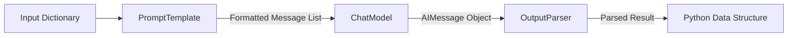

# Module 3: LCEL & Chains

This module details **LangChain Expression Language (LCEL)**, the core engine that powers composition in modern LangChain. We will examine the mechanics of the pipe operator, the `Runnable` protocol, and advanced data flow orchestration.

---

## 💡 Core Theory

### 1. Why LCEL?
In early versions of LangChain, chains were constructed using custom Python classes (e.g., `LLMChain`, `SequentialChain`, `SimpleSequentialChain`). These legacy chains were hard to customize, difficult to monitor, and failed to support asynchronous invocation or streaming without massive boilerplate.

LCEL was introduced to solve these issues. It is a declarative way to compose chains. It offers:
* **First-class Streaming Support**: When you build a chain with LCEL, any step that supports streaming (like a chat model) will stream its output automatically.
* **Asynchronous Callbacks**: You can run any chain asynchronously (`ainvoke`) out-of-the-box.
* **Parallel Execution**: Steps that can run in parallel (like fetching from two different database retrievers) run concurrently.
* **Unified Interface**: Every element in an LCEL chain inherits from the **`Runnable`** interface, establishing a common protocol for inputs, outputs, and executions.

---

### 2. The Mechanics of the Pipe Operator (`|`)
LCEL leverages Python's `__or__` operator overloading. When Python compiles the expression `A | B`, and `A` is a class inheriting from LangChain's `Runnable`, it compiles this into a `RunnableSequence(first=A, last=B)` where the output of `A` is automatically piped as the input to `B`.

```python
# A simple chain:
chain = prompt | model | parser
```



---

### 3. The `Runnable` Protocol
Any component that participates in an LCEL chain must implement the `Runnable` interface. This interface guarantees a standard set of methods:

| Method | Execution | Description |
| :--- | :--- | :--- |
| **`invoke(input, config)`** | Synchronous | Runs the Runnable on a single input. |
| **`ainvoke(input, config)`** | Asynchronous | Runs the Runnable asynchronously. |
| **`stream(input, config)`** | Synchronous | Streams the output chunks back in real-time. |
| **`astream(input, config)`** | Asynchronous | Streams output chunks asynchronously. |
| **`batch(inputs, config)`** | Synchronous | Processes a list of inputs in parallel using multi-threading. |
| **`abatch(inputs, config)`** | Asynchronous | Processes a list of inputs asynchronously. |

---

### 4. Essential Runnable Components

To build complex chains, LangChain provides helper runnables in `langchain_core.runnables`:

#### A. `RunnablePassthrough`
Passes inputs through unchanged, or adds extra keys to a dictionary payload using `.assign()`:
```python
from langchain_core.runnables import RunnablePassthrough

# Example: Takes input, keeps it, and passes it along.
chain = {"original_input": RunnablePassthrough()} | next_step
```

#### B. `RunnableParallel`
Executes multiple tasks concurrently and returns their outputs in a matching dictionary. Extremely useful for running independent steps in parallel:
```python
from langchain_core.runnables import RunnableParallel

# Runs step_a and step_b in parallel
parallel_chain = RunnableParallel(
    branch_one=step_a,
    branch_two=step_b
)
```

#### C. `RunnableLambda`
Wraps a standard Python function so it can be used inside an LCEL pipeline:
```python
from langchain_core.runnables import RunnableLambda

def uppercase_string(text: str) -> str:
    return text.upper()

# Convert the Python function into a Runnable
uppercase_runnable = RunnableLambda(uppercase_string)

chain = prompt | model | parser | uppercase_runnable
```
Using these elements, we can build complex, branching DAGs (Directed Acyclic Graphs) directly in Python.
