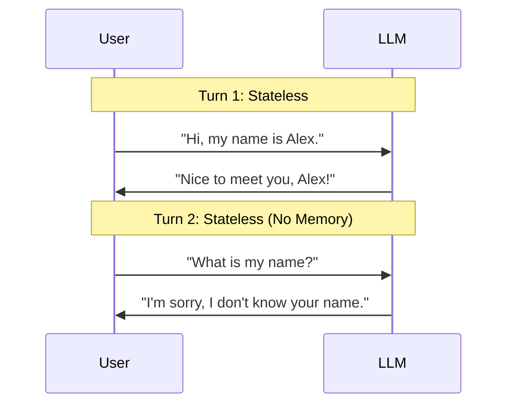
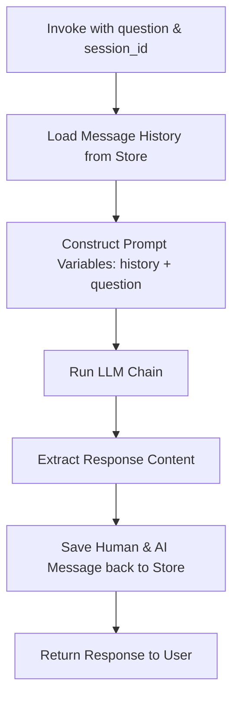

# Module 4: Memory & Chat History

This module covers conversation state management. Since LLM APIs are entirely stateless, we explore how to load, trim, store, and persist conversation logs using memory structures and database history wrappers.

---

## 💡 Core Theory

### 1. The Challenge of Statelessness
Large language models do not possess state. When you call an API, the model has no recollection of your previous prompts or replies:



To create a natural dialogue flow, we must collect all past inputs and outputs, format them as a conversation history, and feed the entire sequence back into the model on every single turn.

---

### 2. Standard Message History Wrappers

LangChain manages lists of messages using wrappers that implement the base `BaseChatMessageHistory` interface:

#### A. In-Memory History (`InMemoryChatMessageHistory`)
Stores messages in the active memory of your Python application process. Good for short sessions or testing.
```python
from langchain_core.chat_history import InMemoryChatMessageHistory

history = InMemoryChatMessageHistory()
history.add_user_message("Hello!")
history.add_ai_message("How can I assist you today?")

print(history.messages)
# Output: [HumanMessage(content='Hello!'), AIMessage(content='...')]
```

#### B. Persistent SQLite History (`SQLChatMessageHistory`)
Stores messages in a local SQLite file so that conversations persist even if the application is restarted.
```python
from langchain_community.chat_message_histories import SQLChatMessageHistory

# Configures a SQLite connection under the hood
history = SQLChatMessageHistory(
    session_id="user_session_123",
    connection_string="sqlite:///chat_history.db"
)
```

---

### 3. Integrating History in Prompt Templates
To inject message histories into prompts, we use a **`MessagesPlaceholder`**. This acts as a dynamic slot where an array of previous messages will be rendered directly inside the chat array:

```python
from langchain_core.prompts import ChatPromptTemplate, MessagesPlaceholder

prompt = ChatPromptTemplate.from_messages([
    ("system", "You are a friendly assistant."),
    # The MessagesPlaceholder name must match the input dictionary key
    MessagesPlaceholder(variable_name="history"),
    ("human", "{question}")
])
```

If we feed `history=[HumanMessage(content="A"), AIMessage(content="B")]` and `question="C"`, the prompt resolves to:
1. `SystemMessage: You are a friendly assistant.`
2. `HumanMessage: A`
3. `AIMessage: B`
4. `HumanMessage: C`

---

### 4. Orchestration with `RunnableWithMessageHistory`
To automate the loop of loading historical messages from a store based on a `session_id`, running our chain, and updating the database with new inputs and outputs, LangChain provides the `RunnableWithMessageHistory` orchestrator.

Here is the flow:



To construct this wrapper, we must define a helper function `get_session_history(session_id: str)`:

```python
from langchain_core.runnables.history import RunnableWithMessageHistory
from langchain_core.chat_history import InMemoryChatMessageHistory

# 1. Maintain a dictionary mapping session_ids to history instances
session_store = {}

def get_session_history(session_id: str):
    if session_id not in session_store:
        session_store[session_id] = InMemoryChatMessageHistory()
    return session_store[session_id]

# 2. Build the core chain
chain = prompt | model

# 3. Wrap it in RunnableWithMessageHistory
conversational_chain = RunnableWithMessageHistory(
    chain,
    get_session_history,
    input_messages_key="question",
    history_messages_key="history",
)
```
When invoking this wrapped chain, we pass the execution variables along with a special `config` dictionary specifying the `session_id`:
```python
response = conversational_chain.invoke(
    {"question": "Hi, my name is Alex."},
    config={"configurable": {"session_id": "session_A"}}
)
```
If we call it again with the same `session_id`, the previous messages will be loaded automatically!
