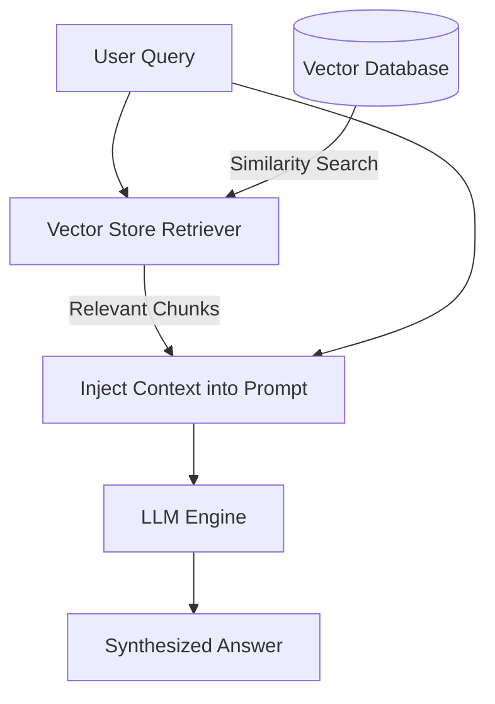

# Module 5: RAG & Vectorstores

This module covers **Retrieval-Augmented Generation (RAG)**. We detail document loaders, recursive text chunking strategies, vector spaces, similarity search indices (using FAISS), and building a full RAG chain using LCEL.

---

## 💡 Core Theory

### 1. What is RAG?
Language models have knowledge cutoffs and lack access to private corporate databases or personal documents. To solve this, **Retrieval-Augmented Generation (RAG)** fetches relevant snippets from an external knowledge base and injects them directly into the LLM's prompt window:



---

### 2. Document Pipelines: Loading & Splitting

#### A. Document Loaders
LangChain provides standard loaders inside `langchain_community.document_loaders` to parse files into generic `Document` objects. Each document contains:
* `page_content`: The raw text string.
* `metadata`: A dictionary holding file metadata (e.g. source filepath, page number).

#### B. Text Splitters
Since documents can exceed LLM token limits, we must cut them into manageable blocks called **chunks**.
* **`RecursiveCharacterTextSplitter`**: The standard chunker. It splits text using a list of separator characters recursively (`["\n\n", "\n", " ", ""]`) in order, attempting to keep paragraphs and sentences together.
* **`chunk_size`**: The maximum character count of each chunk.
* **`chunk_overlap`**: The number of characters shared between consecutive chunks. This maintains semantic continuity so context isn't sliced in half.

---

### 3. Vector Embeddings & Databases

#### A. Embeddings
An embedding model converts a block of text into a fixed-length mathematical vector (an array of floats) representing its semantic meaning.
We will use **`HuggingFaceEmbeddings`** pointing to the open model `"sentence-transformers/all-MiniLM-L6-v2"`. This runs entirely locally on your machine, costs zero API credits, and generates 384-dimensional dense vectors.

#### B. Vector Stores
A vector store handles saving embedding vectors and running similarity searches (like Cosine Similarity or L2 distance) to find text segments that match a query's semantic meaning.
We will use **FAISS** (Facebook AI Similarity Search), a lightweight, in-memory index that is fast and easy to setup without running database servers.

---

### 4. Constructing the RAG Synthesis Chain in LCEL

Once our vector database is built, we expose it as a `Retriever` object.
The LCEL sequence formats the retrieved documents into a single block of context text, constructs the prompt, sends it to the model, and parses the output.

Here is the exact LCEL sequence:

```python
from langchain_core.runnables import RunnablePassthrough
from langchain_core.output_parsers import StrOutputParser

# Helper to concatenate documents together
def format_docs(docs):
    return "\n\n".join(doc.page_content for doc in docs)

# RAG LCEL Composition
rag_chain = (
    # 1. Prepare variables: context is retrieved & formatted, question is passed through
    {"context": retriever | format_docs, "question": RunnablePassthrough()}
    # 2. Inject context and question into prompt
    | prompt
    # 3. Call Model
    | model
    # 4. Clean output response
    | StrOutputParser()
)
```

In the next coding scripts, we'll build and test this entire data flow!
