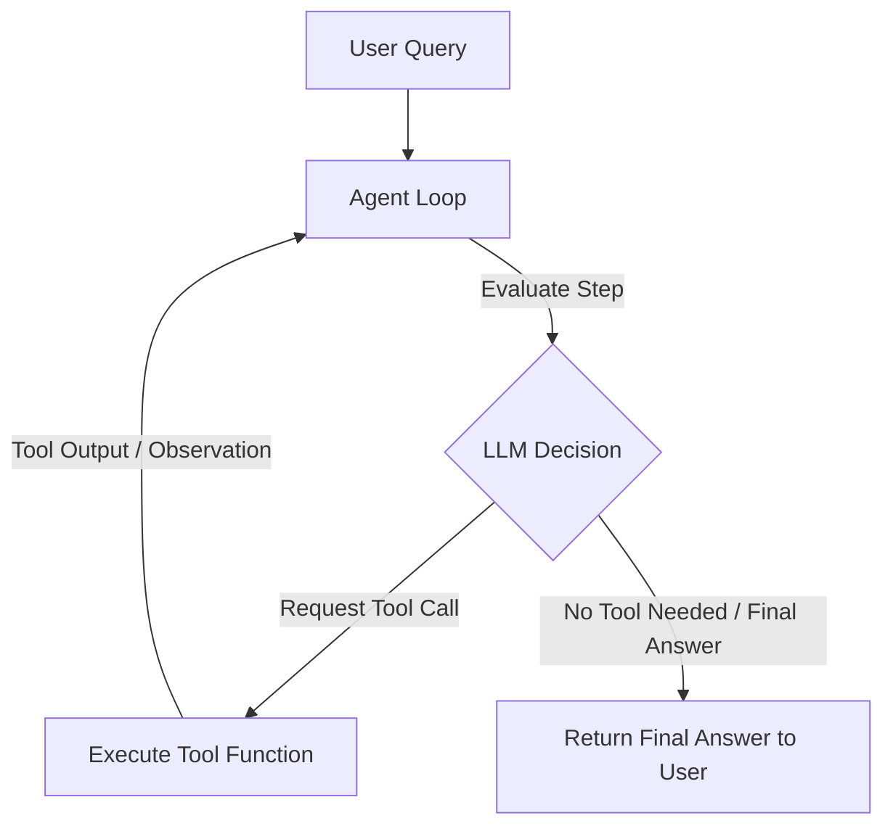

# Module 6: Agents & Tools

This module details **Agents and Tools**. We will examine how to convert Python functions into structured tool schemas, how LLMs make tool-calling requests, and how to run autonomous reasoning loops using the `AgentExecutor`.

---

## 💡 Core Theory

### 1. Chains vs. Agents
In a standard chain, the execution steps are pre-determined by your code (e.g. Prompt -> LLM -> Parser -> Database Query -> Prompt -> LLM). 

An **Agent** uses the language model as a reasoning engine. It has access to a suite of "tools" (APIs, databases, search systems) and dynamically decides which actions to take, what arguments to pass, and when the answer is complete.



---

### 2. Defining Tools using `@tool`
A LangChain Tool is a combination of:
1. A Python function that executes the action.
2. A name and a string description explaining "what" the tool does and "when" the LLM should invoke it.
3. An input schema (usually inferred via Pydantic or type hints).

LangChain provides the **`@tool`** decorator in `langchain_core.tools` to automate this. Under the hood, LangChain parses the function signature and docstring to generate the JSON schema that is bound to the LLM. 

```python
from langchain_core.tools import tool

@tool
def calculate_shipping_cost(weight: float, zip_code: str) -> float:
    """Calculate the shipping fee for a package given its weight and destination zip code.
    
    Args:
        weight: The weight of the package in pounds.
        zip_code: The 5-digit destination zip code.
    """
    # Tool execution logic...
    return weight * 0.15 + (5.0 if zip_code.startswith("9") else 3.0)
```
> [!IMPORTANT]
> The docstring is **not** just documentation for developers; it is parsed and passed directly to the LLM. A vague docstring will cause the model to invoke the tool at incorrect times or with incorrect arguments.

---

### 3. Tool Calling Mechanics
Modern ChatModels support **native tool calling**. When you bind tools to a model, you modify its system payload so that it is aware of the tools. 
When queried, instead of returning a text string, the model returns a structured request asking to run a specific tool:

```python
# Bind tools to the model
model_with_tools = model.bind_tools([calculate_shipping_cost])

# Invoke the model
response = model_with_tools.invoke("How much to ship a 10lb package to 90210?")
```

The output `response` (an `AIMessage`) contains a **`tool_calls`** field:
```json
[
  {
    "name": "calculate_shipping_cost",
    "args": {"weight": 10.0, "zip_code": "90210"},
    "id": "call_123zxy"
  }
]
```

---

### 4. Running the Agent Loop with `AgentExecutor`
To run the loop (LLM returns tool request -> tool runs in Python -> result sent back to LLM -> LLM decides next step), we use the **`AgentExecutor`** orchestrator.

The Agent Executor expects:
- **`agent`**: The logical parser pipeline created using helpers like `create_tool_calling_agent`.
- **`tools`**: The list of tool objects.
- **`verbose`**: If true, prints all internal thoughts, actions, and observations.

Let's build and execute this loop in Python!
