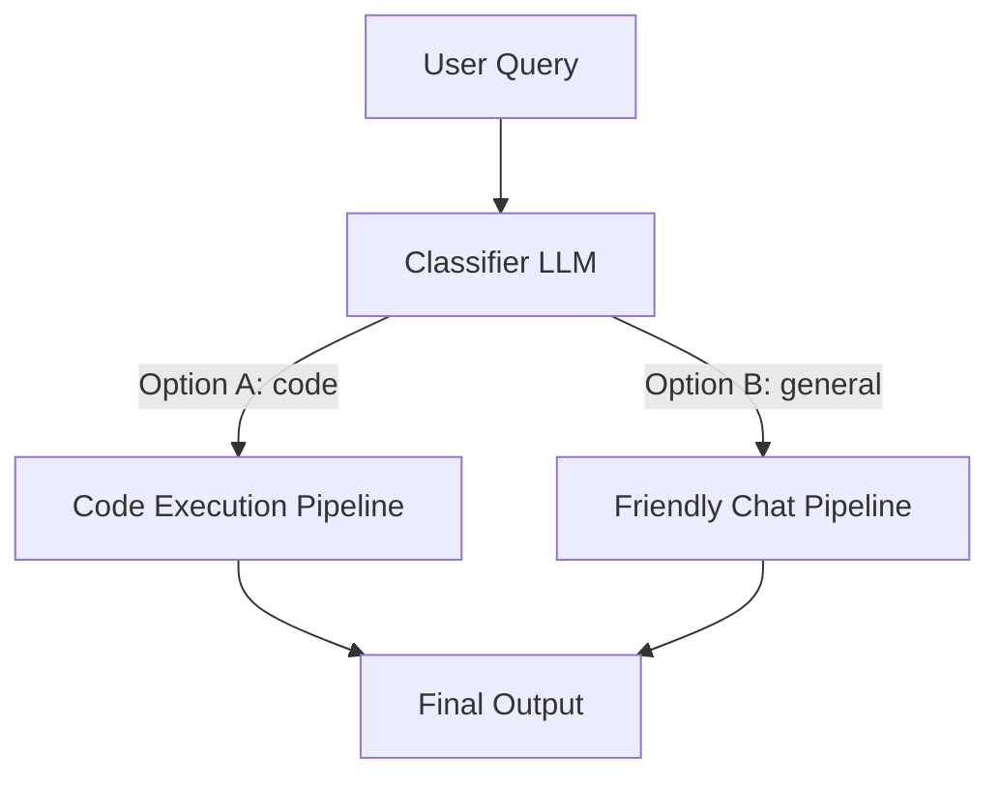

# Module 7: Advanced Concepts & Production Patterns

This module details **Advanced Production Patterns**. We examine asynchronous token/event streams (`astream_events`), API failover strategies using LangChain's `.with_fallbacks()` decorator, and dynamic routing architectures.

---

## 💡 Core Theory

### 1. Asynchronous Event Streams (`astream_events`)
While basic `.stream()` yields text output chunks, complex pipelines containing retrievers, database operations, and multiple model queries need a way to stream *everything* that happens in the backend. 

LangChain provides the **`astream_events(version="v2")`** API. This async generator yields structured event logs as they occur in real-time, categorized by event types:
- `on_chat_model_stream`: Triggered whenever an individual token is generated by the LLM.
- `on_tool_start` / `on_tool_end`: Triggered when an autonomous tool starts and finishes.
- `on_chain_start` / `on_chain_end`: Triggered at sequence boundaries.

Using these events, frontend applications can display a loading spinner for databases, stream intermediate tool logs, and stream the final answer in real-time.

---

### 2. API Failover with Fallbacks
In production environments, external APIs can crash, return rate limit exceptions (HTTP 429), or hit token capacity caps. 
To prevent application downtime, LangChain offers **`.with_fallbacks()`**:

```python
# Create primary and backup models
primary_model = ChatOpenAI(model_name="primary-high-cost-model")
backup_model = ChatOpenAI(model_name="backup-free-model")

# Wrap the model with fallbacks
resilient_model = primary_model.with_fallbacks([backup_model])
```

If `primary_model` throws any API error, LangChain catches the exception and immediately routes the prompt to `backup_model` without breaking the LCEL chain.

---

### 3. Dynamic Routing
Dynamic Routing directs user queries to different downstream sub-chains based on content classification.
For example, we can classify user queries into "Technical Support" or "Billing Support" using a routing model, and then select the corresponding specialized chain:



We can build router steps inside LCEL using the `RunnableBranch` class or standard Python branch selectors wrapped in `RunnableLambda`:

```python
from langchain_core.runnables import RunnableLambda

def route_query(info):
    if "code" in info["topic"].lower():
        return code_chain
    else:
        return general_chain

# The orchestrator chain:
full_routing_chain = (
    {"topic": classifier_chain} # Step 1: classify
    | RunnableLambda(route_query) # Step 2: route dynamically
)
```

In the next scripts, we'll implement these advanced structures.
