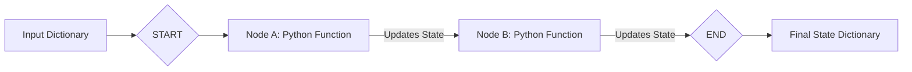

# LangGraph Module 1: Graph Foundations (State, Nodes, Edges)

This module introduces the foundational building blocks of LangGraph: the **State**, **Nodes**, and **Edges**. We will cover how to design state schemas, write node functions, define execution links, compile the graph, and visualize it.

---

## 💡 Core Concepts

LangGraph is built on a simple architectural loop: a **State** is passed between **Nodes** along path **Edges**. Let's examine how each component operates at a technical level.



### 1. The Graph State
The **State** is a shared database that is passed from node to node during execution. Every node can read from this state and write updates to it.
In Python, we typically define the State using a **`TypedDict`** (a typed dictionary) or a Pydantic class.

```python
from typing import TypedDict

class GraphState(TypedDict):
    input_text: str       # Input query from the user
    greeting: str         # The greeting message generated by Node A
    final_output: str     # The processed message generated by Node B
```
> [!IMPORTANT]
> The State behaves like a transaction ledger. When a node runs, it does not replace the entire state. Instead, it returns a dictionary containing *only* the keys it wants to update. LangGraph automatically merges those updates back into the main state dictionary.

---

### 2. Nodes (The Execution Steps)
A **Node** is a standard Python function (sync or async) that performs a specific piece of work.
- **Inputs**: It receives the current `State` as its first parameter.
- **Outputs**: It returns a dictionary specifying updates to the keys of the `State`.

```python
def generate_greeting_node(state: GraphState) -> dict:
    """Takes the input_text and generates a greeting message."""
    print("Executing Node A: greeting generation")
    
    # 1. Read from the state
    user_name = state.get("input_text", "User")
    
    # 2. Compute the update
    greeting_message = f"Hello, {user_name}! Welcome to LangGraph."
    
    # 3. Return only the updated state keys
    return {"greeting": greeting_message}
```

---

### 3. Edges (The Connections)
Edges determine how execution transitions from one node to another. We define them on the graph builder instance:
* **The `START` Edge**: Directs the initial user input into the starting node.
* **Direct Edges**: Moves execution from a source node to a target node in a fixed path.
* **The `END` Edge**: Signals that execution is finished and returns the final state to the caller.

```python
from langgraph.graph import START, END, StateGraph

# 1. Initialize the graph builder passing the State class schema
workflow = StateGraph(GraphState)

# 2. Add our execution nodes
workflow.add_node("greeting_node", generate_greeting_node)
workflow.add_node("processing_node", processing_node)

# 3. Configure the edges
workflow.add_edge(START, "greeting_node")            # Start -> greeting_node
workflow.add_edge("greeting_node", "processing_node") # greeting_node -> processing_node
workflow.add_edge("processing_node", END)             # processing_node -> End
```

---

## 🛠️ Graph Compilation & Execution

Before you can run a graph, you must **compile** it:

```python
app = workflow.compile()
```

### What does `compile()` do?
1. **Validation**: Verifies that every node is reachable from the `START` node, there are no dangling edges pointing to non-existent nodes, and that all nodes correctly match the input state signature.
2. **Runtime Assembly**: Wraps the graph structure in a compiled execution runner. The compiled `app` implements the standard LangChain `Runnable` interface, meaning you can run `invoke`, `stream`, and `batch` calls directly on it!

### Executing the Graph
We invoke the compiled graph by passing the initial state dictionary:

```python
initial_input = {"input_text": "Kmohnish"}
final_state = app.invoke(initial_input)

print(final_state)
# Output contains the merged dictionary:
# {'input_text': 'Kmohnish', 'greeting': 'Hello, Kmohnish!...', 'final_output': '...'}
```

---

## 🎨 Visualizing your Graph
LangGraph provides tools to inspect and display the layout of your graph. You can generate a Mermaid diagram string or display a PNG directly in your Jupyter notebooks:

```python
from IPython.display import Image, display

# Draw the graph structure as a PNG image using the Mermaid API
try:
    display(Image(app.get_graph().draw_mermaid_png()))
except Exception:
    # Fallback to printing ASCII structure if rendering fails
    print(app.get_graph().draw_ascii())
```
This rendering is helpful when debugging complex branching pathways! In the coding lab, we will build, visualize, and execute our first graph.
