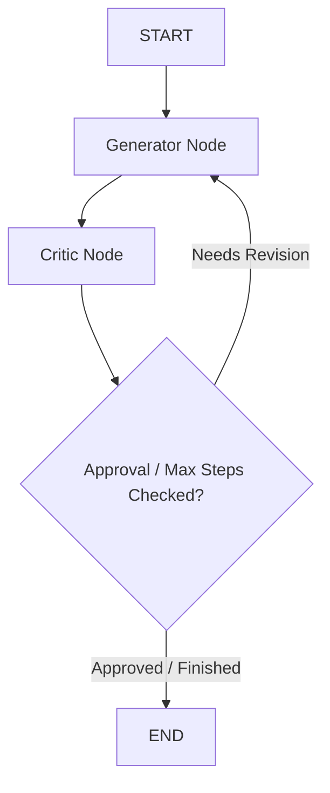

# LangGraph Module 2: Cyclic Graphs & Conditional Routing

This module details **cycles and routing**. We cover how to direct the graph's execution flow dynamically using **conditional edges**, how to build Generator-Critic self-reflection loops, and how to configure graph safety limits to prevent runaway loops.

---

## 💡 Core Theory

### 1. Conditional Edges (Dynamic Routing)
In Module 1, we used direct edges (`add_edge("node_a", "node_b")`) to link nodes in a strict, linear pipeline. To build adaptive agents, the execution flow must change based on what the LLM outputs.

We implement this using **conditional edges**. A conditional edge requires three inputs:
1. **Source Node**: The node whose completion triggers the evaluation.
2. **Routing Function**: A Python function that takes the current `State` and returns a string string value.
3. **Path Map**: A dictionary mapping the returned string string value to target destination nodes.

```python
# 1. Write the routing selector function
def decide_next_step(state: GraphState) -> str:
    # Evaluate variables in the state
    if state.get("is_valid"):
        return "accept"
    else:
        return "retry"

# 2. Add the conditional edge to the builder
workflow.add_conditional_edges(
    "evaluation_node",              # Source Node
    decide_next_step,              # Routing Function
    {                              # Path Map
        "accept": "save_database",  # If decide_next_step returns "accept", go to "save_database"
        "retry": "editor_node"      # If decide_next_step returns "retry", go to "editor_node"
    }
)
```

---

### 2. The Self-Reflection (Generator-Critic) Pattern
One of the most effective agentic patterns is **Self-Reflection**. Instead of accepting the LLM's first draft, we pass the output to a "Critic" node that reviews it, details errors, and requests edits. The Generator consumes the feedback and updates its output. This loop runs until the Critic approves or a maximum cycle count is reached.



---

### 3. Infinite Loop Protection (Recursion Limits)
Because cyclic graphs can loop indefinitely if a model gets stuck in a repetitive state, LangGraph provides built-in safety controls:

#### A. The `recursion_limit` Configuration
When invoking your compiled graph, you can pass a configuration dictionary containing `recursion_limit` (the maximum number of state transitions allowed for a single run):

```python
config = {"recursion_limit": 10}

try:
    result = app.invoke(initial_state, config=config)
except GraphRecursionError:
    print("Execution aborted: Graph exceeded maximum permitted loops.")
```
If the number of execution steps exceeds the threshold (default is 25), LangGraph automatically halts and throws a `GraphRecursionError`, preventing runaway API bills.

#### B. State-Based Loop Counters
As a best practice, you should also add a simple `loop_count` integer to your State class schema, incrementing it at each execution node. This allows your routing functions to check the count and exit gracefully (e.g. outputting the latest draft) before hitting hard limits.

We will build and execute this pattern in the coding lab!
