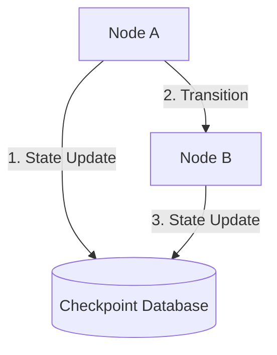

# LangGraph Module 4: Persistence & Memory (Time Travel)

This module covers **Checkpointing and Persistence**. We will analyze how checkpointers serialize graph states, how to use `thread_id` parameters to isolate conversation sessions, and how to execute "Time Travel" to inspect, edit, and resume states from any past execution step.

---

## 💡 Core Theory

### 1. What is Checkpointing?
In standard LLM chains, memory is usually just a list of messages. If the application crashes, intermediate variables, execution steps, and tool states are lost.

In LangGraph, we use **Checkpointers**. A checkpointer automatically takes a snapshot of the **entire graph state** (including message histories, loop counters, metadata, and custom dictionary keys) at every single node transition.



#### Key Benefits:
* **Session Persistence**: Resume conversations across application restarts.
* **Error Recovery**: If a node fails (e.g. an API times out), the graph can resume from the last successful checkpoint instead of starting over.
* **Audit Trails**: Inspect the exact state of the agent at every point in its execution path.
* **Time Travel**: Fork the conversation, edit past responses, or rerun the agent starting from a past state.

---

### 2. Checkpointers and Threads

#### Checkpointer Implementations:
- **`MemorySaver`**: Stores snapshots in active RAM memory. Great for quick unit tests.
- **`SqliteSaver`**: Stores snapshots in a local SQLite file database. Best for persistence.

#### Thread Isolation:
To keep sessions separated, checkpointers use a `thread_id`. The compiled graph requires this parameter passed inside a `config` dictionary:

```python
from langgraph.checkpoint.memory import MemorySaver

# 1. Initialize checkpointer
checkpointer = MemorySaver()

# 2. Compile the graph with checkpointer
app = workflow.compile(checkpointer=checkpointer)

# 3. Configure the unique thread session ID
config = {"configurable": {"thread_id": "user_session_992"}}

# 4. Invoke passing config
app.invoke({"topic": "AI"}, config=config)
```

---

### 3. Time Travel: Fetching & Modifying History

Because the checkpointer retains every state version, we can query, traverse, and modify the execution timeline.

#### A. Fetching State History
You can iterate through all past checkpoints using `get_state_history()`:

```python
# Returns an iterator of past state checkpoints
history = list(app.get_state_history(config))

for state_snapshot in history:
    print(f"Checkpoint Config ID: {state_snapshot.config}")
    print(f"State Values at Step: {state_snapshot.values}")
```

#### B. Forking / Modifying State (`update_state`)
You can insert or overwrite values at a specific checkpoint using `update_state()`. This creates a new timeline fork:

```python
# Target a specific past checkpoint config coordinates
past_config = {"configurable": {"thread_id": "user_session_992", "checkpoint_id": "1ef1-..."}}

# Update the state values at that past step
app.update_state(
    past_config,
    {"business_idea": "An updated manual business idea!"}, # Overwrite keys
    as_node="generate_idea"                               # Identify which node is making the change
)

# Resuming execution from that updated checkpoint config:
app.invoke(None, config=past_config) # Passing None tells the graph to resume from its current checkpoint
```
This is a powerful production pattern for error correction and human-guided execution. In the coding notebook, we will write checkpointing systems and test time-travel forks!
