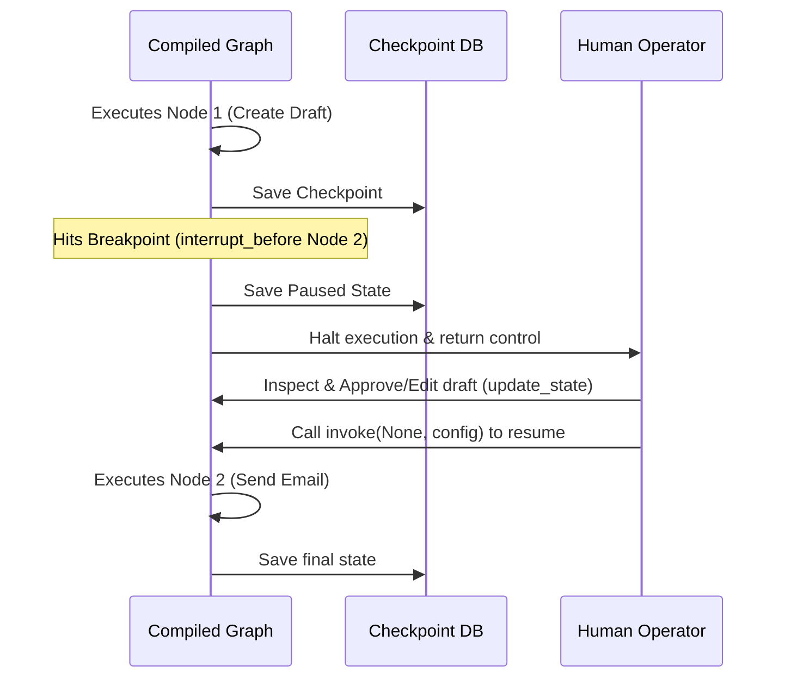

# LangGraph Module 5: Human-in-the-Loop (Interrupts)

This module covers **Human-in-the-Loop (HITL)** engineering. We will examine how to configure compile-time breakpoints (`interrupt_before` and `interrupt_after`), inspect paused execution states, modify variables manually while paused, and resume execution.

---

## 💡 Core Theory

### 1. Why Human-in-the-Loop?
When building autonomous agents, there are actions that should not be executed without verification:
- Sending a corporate email to a customer.
- Charging a credit card or processing a refund.
- Deleting files or executing commands on a server.
- Executing high-risk database transactions.

Instead of writing complex custom session logic in your application to handle pauses, LangGraph incorporates **Breakpoints** directly into its graph runtime.



---

### 2. Setting Breakpoints at Compile Time
When compiling your graph, you can pass lists of node names to either **`interrupt_before`** or **`interrupt_after`**:

```python
# Compile the graph specifying nodes to pause at
app = workflow.compile(
    checkpointer=memory_saver,
    interrupt_before=["send_email_node"] # Pause execution BEFORE running this node
)
```

---

### 3. The Execution Lifecycle of a Breakpoint

#### Step 1: Run the Graph
When you call `invoke()`, the graph runs normally until it hits the node registered in `interrupt_before`:

```python
config = {"configurable": {"thread_id": "session_A"}}
app.invoke({"email_draft": "Hello!"}, config=config)
```
The execution pauses immediately before `send_email_node` runs.

#### Step 2: Verify the Paused State
You can check if the graph is currently paused by inspecting its state:

```python
snapshot = app.get_state(config)

print("Next Node to Run:", snapshot.next) 
# Output: ('send_email_node',) - indicates the graph is paused here!

print("Current State Values:", snapshot.values)
```
If `snapshot.next` contains values, the graph is paused waiting for user input. If it is empty (`None` or `()`), the graph finished executing.

#### Step 3: Modify State (Optional)
The human can review the draft and modify it before resuming. We use `update_state` to change the values:

```python
# The human edits the draft
app.update_state(
    config,
    {"email_draft": "Hello! (Approved and revised by Human)"},
    as_node="chatbot_node"
)
```

#### Step 4: Resume Execution
To tell the graph to resume execution, we call `invoke()`, passing `None` as the input:

```python
# Pass None to continue from the saved checkpoint
app.invoke(None, config=config)
```
The graph resumes, executes `send_email_node` with the updated draft, and runs to completion!
We will implement and test this full validation pattern in the notebook.
