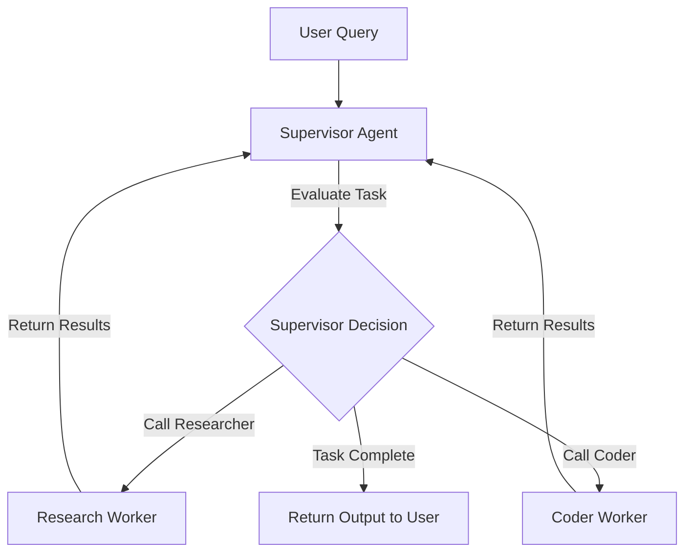

# LangGraph Module 6: Multi-Agent Systems (Collaborative Architectures)

This module covers **Multi-Agent Architectures**. We will analyze when to transition from single-agent designs to multi-agent networks, how to implement Peer-to-Peer workflows and Agent Supervisor orchestrations, and how nodes pass execution scopes to collaborators.

---

## 💡 Core Theory

### 1. The Limits of Single Agents
When building complex systems, developers often try to equip a single agent with dozens of tools and instructions. However, single-agent architectures degrade in performance when overloaded:
- **Focus Loss**: The LLM gets confused by too many system rules, resulting in hallucinations.
- **Incorrect Tool Invocation**: If too many tool schemas are bound, the model struggles to choose the correct function or inputs.
- **Token Capacity**: Prompt payloads swell, increasing latency and cost.

**Multi-Agent Systems** resolve this by dividing the system into distinct, focused specialist nodes (each with a simple prompt, small context, and 1 or 2 tools) that collaborate.

---

### 2. Multi-Agent Topology Patterns

There are two primary ways to link collaborating agents:

#### Pattern A: Peer-to-Peer (Collaborator Network)
Agents hand off execution directly to other specific agents based on hardcoded routing or direct conditional flags:

```
START -> [Researcher Agent] -> [Coder Agent] -> [Tester Agent] -> END
```
Good for linear, structured multi-agent pipelines (like compile chains).

#### Pattern B: Agent Supervisor (Central Orchestrator)
A central "Supervisor" agent acts as the manager. It evaluates the user's initial query and the outputs of worker nodes, dynamically deciding which agent should work next, or whether to return the final answer to the user.



---

### 3. Implementing the Supervisor Pattern

The supervisor implementation requires:
1. **Defining the Workers**: A set of nodes representing the specialists (e.g. `researcher_node`, `coder_node`).
2. **Binding Output Schemas to the Supervisor**: The supervisor LLM must output a structured format indicating who is next in line. We enforce this using structured output schemas:

```python
from pydantic import BaseModel, Field
from typing import Literal

class SupervisorDecision(BaseModel):
    next_step: Literal["researcher", "coder", "FINISH"] = Field(
        description="The next node to execute, or FINISH if the task is complete."
    )
```

3. **Writing the Router Conditional Edge**: An edge that inspects the supervisor's decision and routes execution to the worker node, or exits.

```python
# The routing selector
def route_supervisor(state: MultiAgentState) -> str:
    # Read the supervisor's output decision
    decision = state.get("next_worker")
    if decision == "FINISH":
        return END
    return decision

# Define conditional edge from supervisor to routing targets
workflow.add_conditional_edges(
    "supervisor_node",
    route_supervisor,
    {
        "researcher": "researcher_node",
        "coder": "coder_node",
        "FINISH": END
    }
)
```

In the coding script, we will build a complete operational supervisor managing a Programmer and a Researcher!
