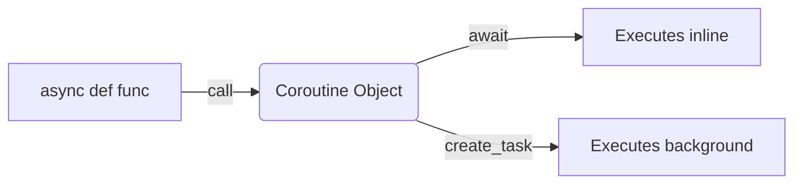

# Concurrency and Asyncio Cheatsheet

## Concurrency Paradigm Decision Matrix

| Workload Type | GIL Impact | Primary Module | Key Characteristics |
| :--- | :--- | :--- | :--- |
| **I/O-Bound** (Network, Disk, DB) | Minimal (GIL released on I/O) | `asyncio` | High concurrency, single thread, cooperative, low overhead, complex syntax. |
| **I/O-Bound** (Legacy/Blocking) | Minimal | `threading` | OS-managed, preemptive, higher memory per thread, simple shared state. |
| **CPU-Bound** (Math, Processing) | Severe (Contention slows down) | `multiprocessing` | True parallelism, separate memory, bypasses GIL, high overhead, IPC needed. |

---

## 1. Threading (`threading`)

**Core Objects:**
*   `Thread(target=fn, args=(...))`: Represents a unit of execution.
*   `Lock()`: Standard mutex.
*   `RLock()`: Reentrant lock (can be acquired multiple times by same thread).

**Basic Pattern:**
```python
import threading
t = threading.Thread(target=worker_fn, args=(1,))
t.start() # Schedules execution
t.join()  # Blocks until thread finishes
```

---

## 2. Multiprocessing (`multiprocessing`)

**Core Objects:**
*   `Process(target=fn, args=(...))`: Spawns a new Python interpreter process.
*   `Queue()`: Process-safe FIFO queue for Inter-Process Communication (IPC).
*   `Pipe()`: Two-way IPC channel.

**Basic Pattern:**
```python
import multiprocessing
if __name__ == '__main__': # CRITICAL for Windows
    p = multiprocessing.Process(target=worker_fn)
    p.start()
    p.join()
```

---

## 3. High-Level Executors (`concurrent.futures`)

**When to use:** When you need a simple pool of workers and don't need fine-grained control over individual thread/process lifecycles.

```python
from concurrent.futures import ThreadPoolExecutor, as_completed

with ThreadPoolExecutor(max_workers=5) as executor:
    # Submitting individual tasks
    future1 = executor.submit(my_func, arg1)
    
    # Mapping over an iterable
    results = executor.map(my_func, [1, 2, 3])
    
    # Processing as they complete
    futures = [executor.submit(my_func, i) for i in range(10)]
    for future in as_completed(futures):
        res = future.result() 
```

---

## 4. Asyncio (`asyncio`) Core Syntax

**Keywords:**
*   `async def`: Defines a coroutine function. Returns a coroutine object, doesn't execute.
*   `await`: Suspends coroutine execution until the awaitable completes. Must be used inside `async def`.

**Execution:**
*   `asyncio.run(main_coro())`: Entry point. Creates loop, runs coro, closes loop.
*   `asyncio.create_task(coro())`: Schedules a coroutine to run concurrently in the background.



---

## 5. Asyncio Structured Concurrency (TaskGroups 3.11+)

Replaces complex `asyncio.gather` with robust error handling and scoping.

```python
async def main():
    try:
        async with asyncio.TaskGroup() as tg:
            t1 = tg.create_task(fetch(url1))
            t2 = tg.create_task(fetch(url2))
        # Exits block ONLY when t1 and t2 are done.
        # If t1 fails, t2 is automatically cancelled.
        print(t1.result(), t2.result())
    except ExceptionGroup as eg:
        # Handle aggregated errors here
        pass
```

---

## 6. Asyncio Synchronization & Queues

*   `asyncio.Lock()`: `async with lock: ...` (Prevents race conditions).
*   `asyncio.Semaphore(value)`: `async with sem: ...` (Rate limiting / Bounding concurrency).
*   `asyncio.Queue(maxsize)`: 
    *   `await q.put(item)` (Blocks if full - Backpressure).
    *   `await q.get()` (Blocks if empty).
    *   `q.task_done()` (Signals consumer processed item).
    *   `await q.join()` (Blocks until all items processed).

---

## 7. Bridging Sync and Async (Crucial Pattern)

**NEVER run blocking I/O or heavy CPU tasks directly in an `async def`!** It blocks the event loop.

```python
import asyncio
import time

def blocking_work(data):
    time.sleep(2) # Simulating heavy/blocking work
    return data * 2

async def main():
    # 3.9+ Method: offloads to default ThreadPool
    result = await asyncio.to_thread(blocking_work, 10)
```
