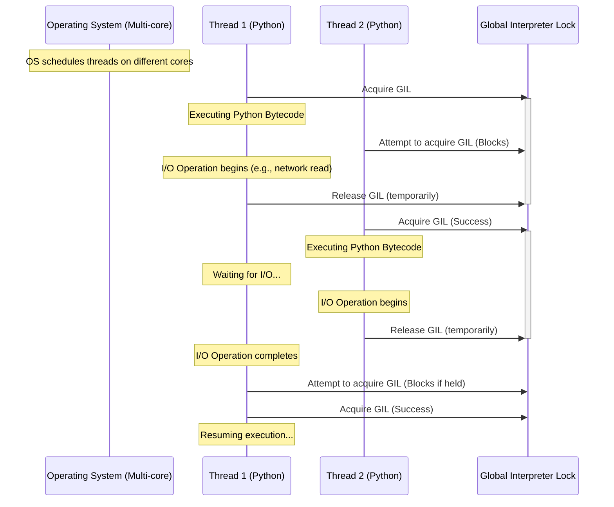
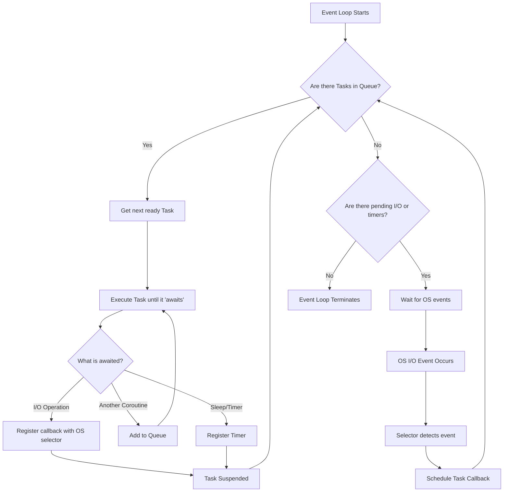

# Module 4: Concurrency and Asyncio in Python

## Introduction to Concurrency Paradigms

Concurrency is the ability of different parts or units of a program, algorithm, or problem to be executed out-of-order or in partial order, without affecting the final outcome. This allows for parallel execution of the concurrent units, which can significantly improve overall speed of the execution in multi-processor and multi-core systems. In more technical terms, concurrency refers to the decomposability property of a program, algorithm, or problem into order-independent or partially-ordered components or units.

In Python, concurrency can be achieved through several distinct paradigms, each with its own specific use cases, advantages, and drawbacks. Understanding these paradigms is crucial for writing high-performance, efficient, and responsive Python applications.

### 1.1 Concurrency vs. Parallelism

It is a common pitfall to confuse concurrency with parallelism. While closely related, they represent distinct concepts in computer science.

*   **Concurrency:** This is about dealing with multiple things at once. It's a structural property of a program. A concurrent program has multiple logical threads of control. These threads may or may not run at the exact same physical instant. On a single-core machine, concurrency is achieved via context switching—the OS rapidly switches execution between different tasks, creating the illusion of simultaneous execution.
*   **Parallelism:** This is about doing multiple things at once. It's an execution property. A parallel program executes multiple tasks at the exact same physical instant. This requires hardware support in the form of multiple processing cores or multiple separate processors.

A program can be concurrent but not parallel (e.g., multitasking on a single core). A program can be parallel but not concurrent (e.g., vector instructions processing multiple data points in a single instruction stream, though this is a low-level form of parallelism). Ideally, a well-designed concurrent program can also be parallelized if the underlying hardware supports it.

### 1.2 The Python Global Interpreter Lock (GIL)

The Global Interpreter Lock (GIL) is perhaps the most infamous aspect of CPython, the reference implementation of the Python programming language. To understand concurrency in Python, one must deeply understand the GIL.

The GIL is a mutex (mutual exclusion lock) that protects access to Python objects, preventing multiple native threads from executing Python bytecodes at once. This lock is necessary mainly because CPython's memory management is not thread-safe.

#### Why does the GIL exist?

CPython uses reference counting for memory management. Every object in Python has a reference count, which keeps track of the number of references that point to it. When this count drops to zero, the object's memory is deallocated.

If multiple threads were to execute Python bytecode simultaneously and modify the reference count of the same object, race conditions could occur. For instance, two threads might simultaneously try to increment the reference count. If they read the old value, increment it, and write it back at the same time, one increment operation could be lost, leading to memory leaks. Conversely, if decrements are lost, objects might never be freed. If multiple decrements happen incorrectly, memory might be freed prematurely, leading to catastrophic crashes when that memory is later accessed.

To solve this, the CPython developers introduced the GIL. The GIL ensures that only one thread executes Python bytecode at any given time. This completely eliminates the possibility of race conditions related to reference counting, simplifying the implementation of CPython and making it easier to integrate with C libraries that are not thread-safe.

#### Impact of the GIL

The GIL has a profound impact on how concurrency is implemented in Python:

1.  **CPU-Bound Tasks:** For tasks that are heavily reliant on CPU computation (e.g., complex mathematical calculations, image processing, cryptography), threading in Python is generally ineffective at providing performance gains on multi-core systems. Because only one thread can execute bytecode at a time, multiple threads will simply contend for the GIL, potentially running slower than a single-threaded approach due to the overhead of context switching and lock acquisition.
2.  **I/O-Bound Tasks:** For tasks that spend most of their time waiting for input/output operations to complete (e.g., reading from a network socket, reading from a disk, querying a database), the GIL is less of an issue. When a Python thread performs an I/O operation, it typically releases the GIL. This allows other threads to execute while the first thread is blocked waiting for the I/O to finish. Therefore, threading can be highly effective for I/O-bound programs.

#### Diagram: GIL Operation



---

## 2. Threading and Multiprocessing

Python provides built-in modules to handle both threading (shared memory, GIL-constrained) and multiprocessing (separate memory spaces, bypasses the GIL).

### 2.1 The `threading` Module

The `threading` module provides a high-level object-oriented API for working with native threads. As discussed, it is best suited for I/O-bound tasks.

#### Creating and Managing Threads

You can create a thread by instantiating the `threading.Thread` class and passing it a target callable.

```python
import threading
import time

def worker_task(name: str, duration: int) -> None:
    """A simple worker function simulating I/O."""
    print(f"Thread {name}: starting work.")
    time.sleep(duration) # Simulates an I/O operation (releases GIL)
    print(f"Thread {name}: finishing work after {duration} seconds.")

def main_threading():
    print("Main thread starting.")
    
    # Create thread objects
    thread1 = threading.Thread(target=worker_task, args=("A", 2))
    thread2 = threading.Thread(target=worker_task, args=("B", 3))
    
    # Start the threads (this schedules them with the OS)
    thread1.start()
    thread2.start()
    
    # Wait for the threads to complete before exiting main program
    print("Main thread waiting for children...")
    thread1.join()
    thread2.join()
    
    print("Main thread finishing.")

if __name__ == "__main__":
    # main_threading()
    pass
```

#### Thread Synchronization Primitives

When multiple threads share state (even just modifying non-CPython internal data structures), synchronization is required to prevent race conditions. The `threading` module provides several primitives:

1.  **Locks (`threading.Lock`):** A standard mutual exclusion lock. Only one thread can acquire it at a time.
2.  **RLocks (`threading.RLock`):** A reentrant lock. A thread can acquire it multiple times without deadlocking itself.
3.  **Semaphores (`threading.Semaphore`):** An internal counter that is decremented upon acquisition and incremented upon release. Useful for limiting concurrent access to a resource.
4.  **Events (`threading.Event`):** A simple communication mechanism where one thread signals an event and other threads wait for it.
5.  **Condition Variables (`threading.Condition`):** Allows threads to wait until a specific condition is met. Always associated with a lock.

```python
import threading
import time

shared_counter = 0
counter_lock = threading.Lock()

def increment_counter(iterations: int) -> None:
    global shared_counter
    for _ in range(iterations):
        # Without this lock, race conditions would cause the final
        # counter value to be inaccurate.
        with counter_lock:
            # Critical section
            current = shared_counter
            # Simulate some processing time inside the critical section
            # time.sleep(0.00001) 
            shared_counter = current + 1

def run_counter_test():
    threads = []
    for _ in range(10):
        t = threading.Thread(target=increment_counter, args=(100000,))
        threads.append(t)
        t.start()

    for t in threads:
        t.join()

    print(f"Final counter value: {shared_counter}")
```

### 2.2 The `multiprocessing` Module

To bypass the GIL and truly utilize multiple CPU cores for CPU-bound tasks, Python provides the `multiprocessing` module. This module uses sub-processes instead of threads. Each process gets its own Python interpreter and its own distinct memory space. Therefore, there is no GIL contention between processes.

#### Creating Processes

The API for `multiprocessing.Process` is intentionally very similar to `threading.Thread`.

```python
import multiprocessing
import time
import math

def compute_heavy_task(name: str, size: int) -> None:
    """A CPU-bound task that calculates factorials."""
    print(f"Process {name} (PID: {multiprocessing.current_process().pid}): starting calculation.")
    start_time = time.time()
    
    # CPU heavy operation
    result = math.factorial(size)
    
    end_time = time.time()
    print(f"Process {name}: Finished in {end_time - start_time:.4f} seconds. Result length: {len(str(result))} digits.")

def main_multiprocessing():
    print(f"Main process (PID: {multiprocessing.current_process().pid}) starting.")
    
    # Note: large factorial values used to ensure CPU is busy
    p1 = multiprocessing.Process(target=compute_heavy_task, args=("Alpha", 100000))
    p2 = multiprocessing.Process(target=compute_heavy_task, args=("Beta", 150000))
    
    p1.start()
    p2.start()
    
    p1.join()
    p2.join()
    print("Main process finishing.")

if __name__ == "__main__":
    # In multiprocessing, it's crucial to guard the entry point
    # to prevent recursive spawning on Windows.
    # main_multiprocessing()
    pass
```

#### Inter-Process Communication (IPC)

Because processes do not share memory, communicating data between them requires explicit mechanisms. The `multiprocessing` module provides several options:

1.  **Queues (`multiprocessing.Queue`):** Thread- and process-safe FIFO queues. The standard way to pass messages or data between processes. Data is serialized (pickled) and passed through a pipe.
2.  **Pipes (`multiprocessing.Pipe`):** Provides a two-way connection between two processes. Faster than queues but handles only two endpoints.
3.  **Shared Memory (`multiprocessing.Value`, `multiprocessing.Array`, `multiprocessing.shared_memory`):** Allows allocating values or arrays that are mapped into the memory space of multiple processes. Requires careful synchronization using locks to avoid race conditions. `shared_memory` (introduced in Python 3.8) allows sharing arbitrary blocks of memory and is very efficient for large data like NumPy arrays.

```python
import multiprocessing

def producer(queue: multiprocessing.Queue, items: int) -> None:
    for i in range(items):
        item = f"Data Block {i}"
        print(f"Producing: {item}")
        queue.put(item)
    queue.put("SENTINEL") # Signal completion

def consumer(queue: multiprocessing.Queue) -> None:
    while True:
        item = queue.get()
        if item == "SENTINEL":
            print("Consumer received sentinel. Terminating.")
            break
        print(f"Consuming: {item}")

def run_ipc_example():
    q = multiprocessing.Queue()
    p_proc = multiprocessing.Process(target=producer, args=(q, 5))
    c_proc = multiprocessing.Process(target=consumer, args=(q,))
    
    p_proc.start()
    c_proc.start()
    
    p_proc.join()
    c_proc.join()
```

### 2.3 `concurrent.futures`

The `concurrent.futures` module provides a higher-level interface for asynchronously executing callables. It abstracts away the direct management of threads or processes by providing ThreadPoolExecutor and ProcessPoolExecutor.

This is often the preferred way to run concurrent tasks if you don't need fine-grained control over the lifecycle of individual threads or processes.

```python
from concurrent.futures import ThreadPoolExecutor, ProcessPoolExecutor, as_completed
import time

def fetch_url_mock(url: str) -> str:
    print(f"Fetching {url}...")
    time.sleep(1) # Simulate network delay
    return f"Content of {url}"

def run_executor_example():
    urls = ["http://example.com/1", "http://example.com/2", "http://example.com/3", "http://example.com/4"]
    
    print("Starting ThreadPoolExecutor...")
    # Use max_workers to limit concurrent threads
    with ThreadPoolExecutor(max_workers=3) as executor:
        # submit() returns a Future object representing the execution
        futures = {executor.submit(fetch_url_mock, url): url for url in urls}
        
        # as_completed yields futures as they finish, regardless of submission order
        for future in as_completed(futures):
            url = futures[future]
            try:
                data = future.result()
                print(f"Completed: {url} -> {data}")
            except Exception as exc:
                print(f"{url} generated an exception: {exc}")
```

---

## 3. Asyncio Core Architecture

`asyncio` is a library to write concurrent code using the `async` and `await` syntax. It is the foundation for numerous Python asynchronous frameworks that provide high-performance network and web-servers, database connection libraries, distributed task queues, etc.

Unlike threading (preemptive multitasking managed by the OS), `asyncio` uses **cooperative multitasking**. The application developer is responsible for explicitly yielding control back to the event loop.

### 3.1 The Event Loop

The event loop is the core of every asyncio application. It runs in a thread (usually the main thread) and executes all the callbacks and asynchronous tasks. It acts as an orchestrator.

The event loop's main responsibilities are:
1.  Maintaining a queue of tasks that are ready to run.
2.  Executing those tasks one by one.
3.  Handling I/O operations asynchronously using OS-level capabilities (like `epoll` on Linux, `kqueue` on macOS, or I/O Completion Ports on Windows).
4.  Resuming tasks when the I/O operations they were waiting for are complete.

#### Diagram: Asyncio Event Loop



### 3.2 Coroutines, Tasks, and Futures

Understanding the hierarchy of objects in asyncio is essential.

#### Coroutines

A coroutine is a specialized version of a Python generator function that can suspend its execution before reaching `return`, and it can indirectly pass control to another coroutine for some time. Coroutines are defined using the `async def` syntax.

Simply calling a coroutine function does not execute it; it returns a coroutine object. To execute it, it must be awaited or scheduled on the event loop.

```python
import asyncio

async def simple_coroutine(name: str) -> str:
    print(f"Coroutine {name} starting.")
    # await yields control back to the event loop
    await asyncio.sleep(1) 
    print(f"Coroutine {name} resuming.")
    return f"Result of {name}"
    
# Calling it just creates the object
# coro_obj = simple_coroutine("Test")
# print(type(coro_obj)) # <class 'coroutine'>
```

#### Futures

A `Future` is a special low-level awaitable object that represents an eventual result of an asynchronous operation. When a Future object is awaited, it means that the coroutine will wait until the Future is resolved in some other place. Futures are typically used to bridge low-level callback-based code with high-level async/await code. You rarely need to create Futures directly in application-level code.

#### Tasks

A `Task` is a subclass of `Future` that wraps a coroutine. When a coroutine is wrapped in a Task, it is automatically scheduled to run on the event loop. Tasks are the primary way to run coroutines concurrently.

You create a Task using `asyncio.create_task()`.

```python
import asyncio
import time

async def cpu_bound_sim(name: str, delay: float):
    print(f"Task {name} starting processing.")
    # Simulate non-blocking work
    await asyncio.sleep(delay)
    print(f"Task {name} finished processing.")
    return name

async def main_asyncio_demo():
    print(f"Main coroutine started at {time.strftime('%X')}")
    
    # Create tasks. They are immediately scheduled on the loop.
    task1 = asyncio.create_task(cpu_bound_sim("A", 2.0))
    task2 = asyncio.create_task(cpu_bound_sim("B", 3.0))
    
    # The tasks are running concurrently in the background now.
    print("Tasks created. Doing other things in main...")
    await asyncio.sleep(1.0)
    print("Main still working...")
    
    # Await the tasks to get their results and ensure completion.
    # The main coroutine suspends here until task1 is done.
    res1 = await task1
    # Then it suspends until task2 is done (which might already be done).
    res2 = await task2
    
    print(f"Main coroutine finished at {time.strftime('%X')}")
    print(f"Results: {res1}, {res2}")

# To run the top-level coroutine:
# asyncio.run(main_asyncio_demo())
```

### 3.3 Awaiting Multiple Callables: `asyncio.gather`

Often, you want to launch many concurrent operations and wait for all of them to complete. `asyncio.gather()` is a common utility for this. It takes multiple awaitables, schedules them as tasks if necessary, and returns a list of their results in the same order they were passed in.

```python
import asyncio

async def fetch_data(id: int, delay: float) -> dict:
    print(f"Fetching data for ID {id}...")
    await asyncio.sleep(delay)
    return {"id": id, "data": f"Data payload for {id}"}

async def batch_fetch():
    print("Starting batch fetch...")
    
    # gather schedules all these coroutines concurrently
    results = await asyncio.gather(
        fetch_data(1, 1.5),
        fetch_data(2, 0.5),
        fetch_data(3, 1.0)
    )
    
    print("Batch fetch complete.")
    for r in results:
        print(r)
        
# asyncio.run(batch_fetch())
```

---

## 4. Structured Concurrency & Advanced Asyncio Patterns

While `asyncio.create_task()` and `asyncio.gather()` are powerful, managing complex graphs of concurrent tasks, especially when handling cancellations and errors, can become unwieldy. Structured concurrency aims to solve this by providing clear scoping rules for concurrent operations.

### 4.1 TaskGroups (Python 3.11+)

Introduced in Python 3.11, `asyncio.TaskGroup` provides a robust mechanism for structured concurrency. It acts as an asynchronous context manager.

Key guarantees of TaskGroups:
1.  **Lifetime bound to context:** The context manager (`async with`) will not exit until *all* tasks created within the group have completed.
2.  **Error propagation:** If any task within the group fails with an unhandled exception, the TaskGroup cancels *all other pending tasks* in the group. Once all tasks are cancelled and finished, the original exception is raised out of the context block (wrapped in an `ExceptionGroup`).

This makes error handling and resource cleanup significantly more predictable than managing raw tasks.

```python
import asyncio
import time

async def worker(task_id: int, delay: float, fail: bool = False):
    print(f"Worker {task_id}: started.")
    try:
        await asyncio.sleep(delay)
        if fail:
            print(f"Worker {task_id}: crashing intentionally!")
            raise ValueError(f"Worker {task_id} failed!")
        print(f"Worker {task_id}: completed successfully.")
        return task_id
    except asyncio.CancelledError:
        print(f"Worker {task_id}: was cancelled.")
        raise # Important: always re-raise CancelledError if caught

async def demo_taskgroup_success():
    print("--- TaskGroup Success Demo ---")
    async with asyncio.TaskGroup() as tg:
        task1 = tg.create_task(worker(1, 1.0))
        task2 = tg.create_task(worker(2, 1.5))
        task3 = tg.create_task(worker(3, 0.5))
    
    # Control only reaches here when all tasks succeed
    print(f"Results: {task1.result()}, {task2.result()}, {task3.result()}")

async def demo_taskgroup_failure():
    print("\n--- TaskGroup Failure Demo ---")
    try:
        async with asyncio.TaskGroup() as tg:
            tg.create_task(worker(4, 2.0)) # This will be cancelled
            tg.create_task(worker(5, 0.5, fail=True)) # This will crash
            tg.create_task(worker(6, 3.0)) # This will be cancelled
    except ExceptionGroup as eg:
        print("Caught ExceptionGroup from TaskGroup!")
        for exc in eg.exceptions:
            print(f"  - Contained Exception: {repr(exc)}")

# asyncio.run(demo_taskgroup_success())
# asyncio.run(demo_taskgroup_failure())
```

### 4.2 Asyncio Synchronization Primitives

Just like the `threading` module, `asyncio` provides primitives to coordinate tasks that share state or resources. Crucially, these primitives are designed to suspend the task (using `await`) rather than blocking the entire OS thread.

*   `asyncio.Lock`: Protects shared state.
*   `asyncio.Semaphore`: Limits concurrent access to a resource.
*   `asyncio.Event`: Signals between tasks.
*   `asyncio.Condition`: Advanced signaling.

#### Example: Rate Limiting with Semaphores

A common use case for a Semaphore is to limit the number of concurrent outgoing HTTP requests to avoid overwhelming an API server.

```python
import asyncio

async def fetch_api(session_id: int, sem: asyncio.Semaphore, delay: float):
    # Wait until a slot in the semaphore is available
    async with sem:
        print(f"Session {session_id}: Acquired semaphore. Making request...")
        await asyncio.sleep(delay) # Simulate API call
        print(f"Session {session_id}: Request complete. Releasing semaphore.")
        return f"Data {session_id}"

async def rate_limited_runner():
    # Only allow 2 concurrent executions
    semaphore = asyncio.Semaphore(2)
    
    async with asyncio.TaskGroup() as tg:
        for i in range(1, 6):
            # All tasks are created immediately, but the semaphore
            # restricts how many actually execute the critical section at once.
            tg.create_task(fetch_api(i, semaphore, 1.0))

# asyncio.run(rate_limited_runner())
```

### 4.3 Asyncio Queues

`asyncio.Queue` is designed for passing data between asyncio tasks in a producer-consumer pattern. It is the async equivalent of `queue.Queue`.

```python
import asyncio
import random

async def queue_producer(name: str, queue: asyncio.Queue, items: int):
    for i in range(items):
        await asyncio.sleep(random.uniform(0.1, 0.5))
        item = f"Item-{i} from {name}"
        await queue.put(item)
        print(f"Producer {name} added: {item}")
    
async def queue_consumer(name: str, queue: asyncio.Queue):
    while True:
        # Suspend until an item is available
        item = await queue.get()
        print(f"Consumer {name} processing: {item}")
        await asyncio.sleep(random.uniform(0.2, 0.6))
        # Tell the queue the item is processed
        queue.task_done()

async def run_queue_system():
    queue = asyncio.Queue(maxsize=10) # Bounded queue applies backpressure
    
    # Start consumers
    consumers = [
        asyncio.create_task(queue_consumer("C1", queue)),
        asyncio.create_task(queue_consumer("C2", queue))
    ]
    
    # Start producers
    producers = [
        asyncio.create_task(queue_producer("P1", queue, 5)),
        asyncio.create_task(queue_producer("P2", queue, 5))
    ]
    
    # Wait for producers to finish adding all items
    await asyncio.gather(*producers)
    
    # Wait until all items in the queue have been processed (task_done called)
    await queue.join()
    
    # Cancel consumers as they are in an infinite loop
    for c in consumers:
        c.cancel()

# asyncio.run(run_queue_system())
```

### 4.4 Task Cancellation in Depth

Cancellation is a critical aspect of robust asyncio applications. When a task is cancelled (e.g., via `task.cancel()`, or a timeout, or a TaskGroup failure), the event loop raises an `asyncio.CancelledError` inside the coroutine at the current `await` point.

**Rules of Cancellation:**
1.  **Catching CancelledError:** You can catch `asyncio.CancelledError` to perform cleanup (closing files, rolling back transactions).
2.  **Re-raising is Mandatory:** If you catch it, you **must** re-raise it (or a subclass) so the event loop knows the task actually terminated due to cancellation. Swallowing a CancelledError breaks the cancellation contract.
3.  **Shielding:** If a critical operation must not be interrupted even if the parent task is cancelled, wrap it in `asyncio.shield()`.

```python
import asyncio

async def critical_db_update():
    print("DB Update: Starting critical transaction...")
    try:
        await asyncio.sleep(2) # Simulating long update
        print("DB Update: Transaction committed successfully.")
    except asyncio.CancelledError:
        print("DB Update: Cancelled! Initiating rollback...")
        # Simulate rollback taking time
        # Note: can't await normal things easily during cancellation handling
        # without special care, but simple synchronous cleanup is fine.
        print("DB Update: Rollback complete.")
        raise # MUST RE-RAISE

async def main_cancellation_demo():
    task = asyncio.create_task(critical_db_update())
    
    await asyncio.sleep(0.5) # Let it start
    print("Main: Issuing cancel request to task.")
    task.cancel()
    
    try:
        await task
    except asyncio.CancelledError:
        print("Main: Task confirmed cancelled.")

# asyncio.run(main_cancellation_demo())
```

### 4.5 Mixing Blocking Code with Asyncio

A common problem is calling a synchronous, blocking function (like `requests.get` or a heavy CPU calculation) from inside an async coroutine. Doing this directly will block the entire event loop, freezing all other tasks.

To solve this, use `loop.run_in_executor()` or `asyncio.to_thread()` (Python 3.9+). This offloads the blocking execution to a separate thread or process pool, allowing the event loop to continue running.

```python
import asyncio
import time
import requests

def blocking_io_network_call(url: str) -> int:
    """A standard synchronous blocking network call."""
    print(f"Blocking request to {url} starting on thread...")
    response = requests.get(url) # This blocks!
    print(f"Blocking request to {url} finished.")
    return response.status_code

async def async_main_with_blocking():
    print("Async main starting.")
    url = "https://www.python.org"
    
    # CORRECT WAY: Offload to a background thread
    print("Offloading blocking call to thread...")
    # asyncio.to_thread runs the function in a default ThreadPoolExecutor
    status_task = asyncio.to_thread(blocking_io_network_call, url)
    
    # While the thread runs, the event loop can do other things
    print("Doing async work while thread runs...")
    await asyncio.sleep(1)
    
    # Await the result from the thread
    status = await status_task
    print(f"Result from blocking call: {status}")

# asyncio.run(async_main_with_blocking())
```

---
# Conclusion

Mastering concurrency in Python requires understanding the limitations of the GIL and choosing the right tool for the job. 
- Use `multiprocessing` for CPU-bound intensive computations.
- Use `threading` or `concurrent.futures.ThreadPoolExecutor` for simple I/O bound scripts or legacy synchronous libraries.
- Use `asyncio` for highly scalable I/O bound applications, network servers, and applications requiring complex orchestration of concurrent state machines. By adopting structured concurrency patterns like `TaskGroup`, you can build robust and maintainable asynchronous systems.
